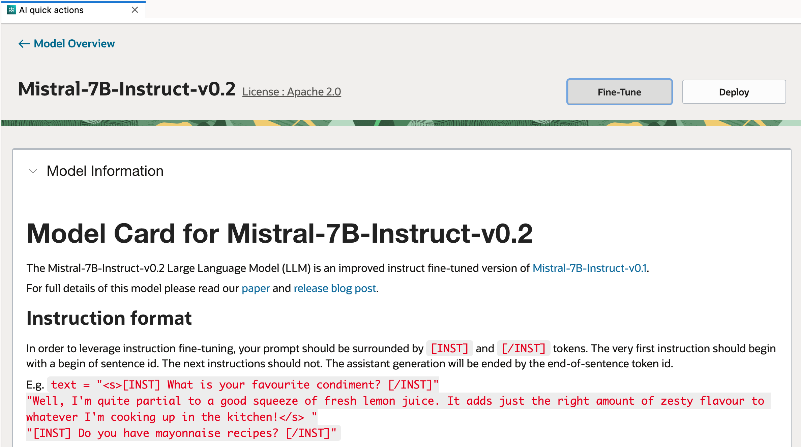
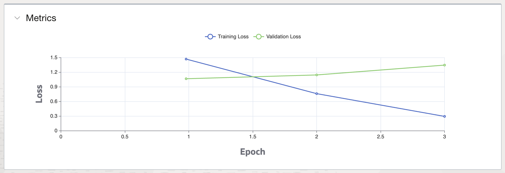

# LLM Fine-Tuning

## Introduction

Powerful large language models (LLMs), such as Llama2 and Mistral, have been pre-trained on vast amounts of text data, enabling them to understand and generate human-like text. However, more potential of LLMs can unlocked through fine-tuning.

Fine-tuning is the art of tailoring a pre-trained model to excel in specific tasks or domains. This customization is crucial because, despite their general proficiency, LLMs may not perform optimally on specialized tasks without further training. By fine-tuning an LLM on a domain-specific dataset, we can enhance its performance, making it more adept at understanding and responding to the nuances of that domain.

During fine-tuning, the model is trained a new dataset containing examples that are representative of the tasks it will perform. Through fine-tuning, the model's parameters are adjusted, effectively teaching it the finer details of the task at hand. This results in a model that is not only proficient in general language skills but also fine-tuned for specific applications.

One of the most significant benefits of fine-tuning is the reduction in resources required. Training an LLM from scratch is a resource-intensive endeavor, both in terms of computational power and time. Fine-tuning, on the other hand, leverages the heavy lifting already done during the pre-training phase, requiring only a fraction of the resources to specialize the model.

The practical applications of fine-tuned LLMs are vast. From enhancing customer service ChatBots to providing more accurate healthcare suggestions, the implications are profound. In the realm of software development, fine-tuned LLMs can assist developers by providing contextually relevant code suggestions, thereby streamlining the development process.

AI Quick Actions is progressively introducing fine-tuning capabilities to more LLMs. In the model explorer, models supporting fine-tuning are displayed with the label "Ready to Fine Tune".


### Method

The primary method used by AI Quick Action for fine-tuning is Low-Rank Adaptation ([LoRA](https://huggingface.co/docs/peft/main/en/conceptual_guides/lora)). LoRA stands out as a parameter-efficient fine-tuning method that allows for the adaptation of pre-trained models to specific tasks without the need to retrain the entire model. This technique is particularly beneficial for those who wish to leverage the power of LLMs while operating within the constraints of limited computational resources.

The essence of LoRA lies in its ability to freeze the pre-trained weights of a model and introduce trainable matrices at each layer of the transformer architecture. These matrices are designed to have a lower rank compared to the original weight matrices, which significantly reduces the number of parameters that need to be updated during the fine-tuning process. As a result, LoRA not only curtails the computational burden but also mitigates the risk of catastrophic forgetting—a phenomenon where a model loses its previously acquired knowledge during the fine-tuning phase.

In AI Quick Actions, the following [LoRA config parameters](https://huggingface.co/docs/peft/main/en/conceptual_guides/lora#common-lora-parameters-in-peft) are used for fine-tuning the model:
```
{
    "r": 32,
    "lora_alpha": 16,
    "lora_dropout": 0.05,
}
```

All linear modules in the model are used as the `target_modules` for LoRA fine-tuning.

### Dataset

The success of fine-tuning LLMs heavily relies on the quality and diversity of the training dataset. Preparing a dataset for fine-tuning involves several critical steps to ensure the model can effectively learn and adapt to the specific domain or task at hand. The process begins with collecting or creating a dataset that is representative of the domain or task, ensuring it covers the necessary variations and nuances. Once the dataset is assembled, it must be preprocessed, which includes cleaning the data by removing irrelevant information, normalizing text, and possibly anonymizing sensitive information to adhere to privacy standards.

For fine-tuning in AI Quick Actions, the dataset
- Must be in [jsonl](https://jsonlines.org/) format.
- Should contain keys: `prompt` and `completion` for each row.

The `prompt` is the input to the LLM and the `completion` is the expected output from the LLM. You may want to format the `prompt` with specific template depending on your task.

Here is a couple examples in the dataset prepared for the task of summarizing conversations. The raw data is taken from the [samsum dataset](https://huggingface.co/datasets/samsum) and formatted to be used by fine-tuning in AI Quick Actions:

```
{"prompt": "Summarize this dialog:\nAmanda: I baked  cookies. Do you want some?\r\nJerry: Sure!\r\nAmanda: I'll bring you some tomorrow :-)\n---\nSummary:\n", "completion": "Amanda baked cookies and will bring some for Jerry tomorrow."}
{"prompt": "Summarize this dialog:\nOlivia: Who are you voting for in this election? \r\nOliver: Liberals as always.\r\nOlivia: Me too!!\r\nOliver: Great\n---\nSummary:\n", "completion": "Olivia and Olivier are voting for liberals in this election. "}
```

### Fine-Tune a Model

By clicking on one of the "Ready to Fine Tune" models, you will see more details of the model. You can initiate a fine-tuning job to create a fine-tuned model by clicking on the "Fine Tune" button.



There are a few configurations for fine-tuning the model:
* Model Information. Here you may customize the name and description of the model.
* Dataset. You may choose a dataset file from object storage location or select a new dataset from your notebook session. Here you will also specify the percentage of the dataset you would like to split for training/validation (evaluation).
* Model Version Set. You may group the fine-tuned models with model version sets.
* Results. Here you specify the object storage location for saving the outputs of the fine-tuned model. Please note that versioning must be enabled.

In addition, you will need to specify the infrastructure and parameters for fine-tuning job:
* Shape. A GPU shape is required for fine-tuning. You may use either a [VM shape](https://docs.oracle.com/en-us/iaas/Content/Compute/References/computeshapes.htm#vm-gpu) or [BM shape](https://docs.oracle.com/en-us/iaas/Content/Compute/References/computeshapes.htm#bm-gpu) for larger models. Fine-tuning requires substantial computational resources, particularly memory, to store model weights, optimizer states, gradients, and the data being processed. Adequate GPU memory ensures that larger batches of data can be processed simultaneously, which can lead to more efficient fine-tuning. 
* Replica. This is the number nodes to be used for the fine-tuning job. Distributed training will be configured automatically when multiple GPUs are available. We recommend using single replica when possible to avoid the communication overhead between nodes, which adversely impacts the fine-tuning performance. AI Quick Actions will gradually roll out the multi-node distributed training support for larger models.
* Networking. VCN and subnet are needed for distributed training (replica > 1). For single replica, default networking will be used automatically.
* Logging. Logging is required for distributed training as the nodes will coordinate using logging. For single replica, logging is optional but highly recommended for debugging purpose.
* Parameters. You can specify the number epochs and learning rate for the fine-tuning.

### Distributed Training

Distributed training leverage multiple GPUs to parallelize the fine-tuning. Recent advancements in distributed training frameworks have made it possible to train models with billions of parameters. Frameworks like [DeepSpeed](https://www.deepspeed.ai/) and [FSDP](https://pytorch.org/blog/introducing-pytorch-fully-sharded-data-parallel-api/) have been developed to optimize distributed training. AI Quick Actions will configure the distributed training automatically when multiple GPUs are available. It is important to note that the communication between multiple nodes incurs significant overhead comparing to the communication between multiple GPUs within a single node. Therefore, it is highly recommended that single replica is used when possible. Multi-node fine-tuning may not have better performance than single node fine-tuning when the number of replica is less than 5.

### Training Metrics

Once the fine-tuning job is successfully submitted, a fine-tuned model will be created in the model catalog. The model details page will be displayed and the lifecycle state will be "In progress" as the job is running. At the end of each epoch, the loss and accuracy will be calculated and updated in the metrics panel.



The accuracy metric reflects the proportion of correct completions made by the model on a given dataset. A higher accuracy indicates that the model is performing well in terms of making correct completions. On the other hand, the loss metric represents the model's error. It quantifies how far the model's completions are from the actual target completions. The goal during training is to minimize this loss function, which typically involves optimizing the model's weights to reduce the error on the training data.

As the training progresses, monitoring both accuracy and loss provides insights into the model's learning dynamics. A decreasing loss alongside increasing accuracy suggests that the model is learning effectively. However, it's important to watch for signs of over-fitting, where the model performs exceptionally well on the training data but fails to generalize to new, unseen data. This can be detected if the validation loss stops decreasing or starts increasing, even as training loss continues to decline.
