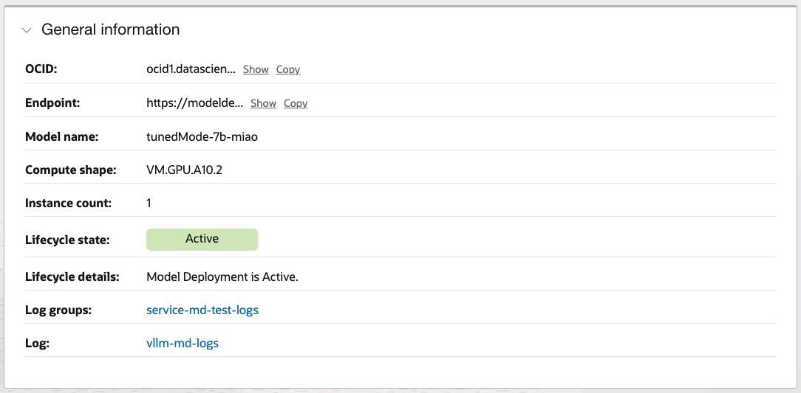

# Model Deployment

Table of Contents:

- [Home](README.md)
- [Policies](policies/README.md)
- [CLI](cli-tips.md)
- [Model Fine Tuning](fine-tuning-tips.md)
- [Model Evaluation](evaluation-tips.md)

## Introduction to [vLLM](https://github.com/vllm-project/vllm)

The Data Science server has prebuilt service containers that make deploying a large 
language model very easy. vLLM (A high-throughput and memory-efficient inference and serving
engine for LLMs) is used in the service container to host the model, the end point created
supports the OpenAI API protocol.  This allows the model deployment to be used as a drop-in
replacement for applications using OpenAI API. Model deployments are a managed resource in 
the OCI Data Science service. For more details about Model Deployment and managing it through 
the OCI console please see the [OCI docs](https://docs.oracle.com/en-us/iaas/data-science/using/model-dep-about.htm).

### Deploying an LLM

After picking a model from the model explorer, if the "Deploy Model" is enabled you can use this
form to quickly deploy the model:


The compute shape selection is critical, the list available is selected to be suitable for the 
chosen model.

- VM.GPU.A10.1 has 24GB of GPU memory and 240GB of CPU memory. The limiting factor is usually the
GPU memory which needs to be big enough to hold the model.
- VM.GPU.A10.2 has 48GB GPU memory
- BM.GPU.A10.4 has 96GB GPU memory and runs on a bare metal machine, rather than a VM.

For a full list of shapes and their definitions see the [compute shape docs](https://docs.oracle.com/en-us/iaas/Content/Compute/References/computeshapes.htm)

The relationship between model parameter size and GPU memory is roughly 2x parameter count in GB, so for example a model that has 7B parameters will need a minimum of 14 GB for inference. At runtime the
memory is used for both holding the weights, along with the concurrent contexts for the user's requests.

The model will spin up and become available after some time, then you're able to try out the model 
from the deployments tab using the test model, or programmatically.


### Using A Model

#### Using oci-cli

```bash
oci raw-request --http-method POST --target-uri https://modeldeployment-int.us-ashburn-1.oci.oc-test.com/ocid1.datasciencemodeldeploymentint.oc1.iad.xxxxxxxxx/predict --request-body '{
        "model": "odsc-llm",
        "prompt":"what are activation functions?",
        "max_tokens":250,
        "temperature": 0.7,
        "top_p":0.8,
    }' --auth <auth_method>
```

#### Using Python SDK (without streaming)

```python
# The OCI SDK must be installed for this example to function properly.
# Installation instructions can be found here: https://docs.oracle.com/en-us/iaas/Content/API/SDKDocs/pythonsdk.htm
 
import requests
from oci.signer import Signer
from oci.config import from_file

config = from_file('~/.oci/config')
auth = Signer(
    tenancy=config['tenancy'],
    user=config['user'],
    fingerprint=config['fingerprint'],
    private_key_file_location=config['key_file'],
    pass_phrase=config['pass_phrase']
)

endpoint = "https://modeldeployment-int.us-ashburn-1.oci.oc-test.com/ocid1.datasciencemodeldeploymentint.oc1.iad.xxxxxxxxx/predict"
body = {
    "model": "odsc-llm", # this is a constant
    "prompt": "what are activation functions?",
    "max_tokens": 250,
    "temperature": 0.7,
    "top_p": 0.8,
}

res = requests.post(endpoint, json=body, auth=signer, headers={}).json()

print(res)
```

#### Using Python SDK (with streaming)

```python
# The OCI SDK must be installed for this example to function properly.
# Installation instructions can be found here: https://docs.oracle.com/en-us/iaas/Content/API/SDKDocs/pythonsdk.htm
 
import requests
from oci.signer import Signer
from oci.config import from_file

config = from_file('~/.oci/config')
auth = Signer(
    tenancy=config['tenancy'],
    user=config['user'],
    fingerprint=config['fingerprint'],
    private_key_file_location=config['key_file'],
    pass_phrase=config['pass_phrase']
)

endpoint = "https://modeldeployment-int.us-ashburn-1.oci.oc-test.com/ocid1.datasciencemodeldeploymentint.oc1.iad.xxxxxxxxx/predict"
body = {
    "model": "odsc-llm", # this is a constant
    "prompt": "what are activation functions?",
    "max_tokens": 250,
    "temperature": 0.7,
    "top_p": 0.8,
    "stream": True,
}

# open session to enable streaming
sess = requests.Session()

with sess.post(
    endpoint,
    auth=signer,
    headers={
      'enable-streaming': true
    },
    data=json.dumps(body),
    stream=True,
) as resp:
    for chunk in resp.iter_lines():
        chunk = chunk.decode("utf-8")
        print(chunk)
```

### Troubleshooting

If the model should fail to deploy, reasons might include lack of GPU availability, or policy permissions.

The logs are a good place to start to diagnose the issue. The logs can be accessed from the UI, or you can
use the ADS Log watcher, see [here](https://accelerated-data-science.readthedocs.io/en/latest/user_guide/cli/opctl/_template/monitoring.html) for more details.

From the **General Information** section the **Log Groups** and **Log** sections are clickable links to 
begin the diagnosis.



Table of Contents:

- [Home](README.md)
- [Policies](policies/README.md)
- [CLI](cli-tips.md)
- [Model Fine Tuning](fine-tuning-tips.md)
- [Model Evaluation](evaluation-tips.md)
