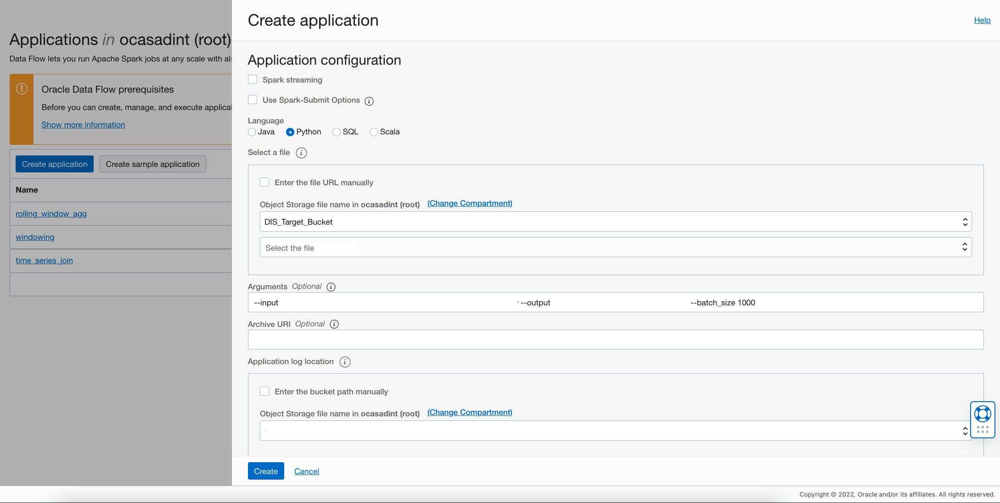
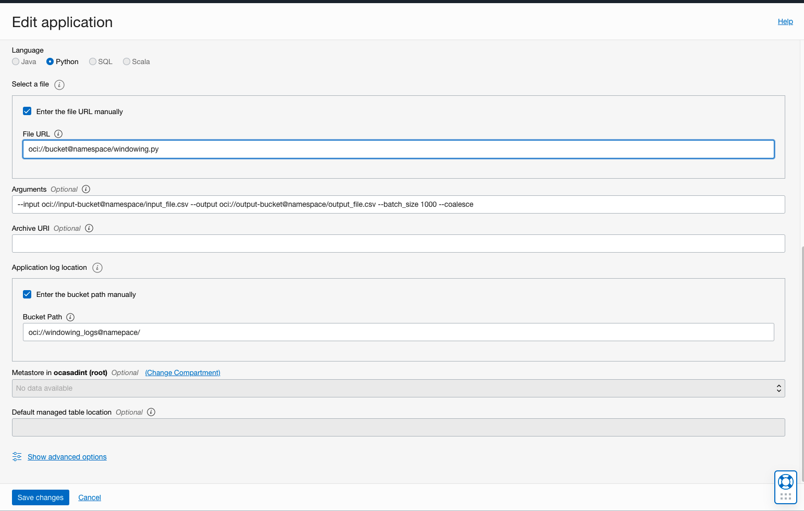

# DF: Fixed Window Batching

## Use case

```
You have a large file/table that has more than 300k data points, and you want to break it down into equal sized chunks so that you can detect
anomalies in each chunk using OCI Anomaly Detection service.
```
## Steps


Download the [example Spark application](./example_code/fixed_window_batching.py)

Upload the code to OCI Object Storage(in case of Scala or Java, upload the compiled JAR file).?Note the path to the code eg. bucket dataflow-
warehouse, root folder, file name pivoting.py. You can view an example of the same [here](./example_code/fixed_window_batching.py). 
<br>
<br>
If there are multiple files, ensure they are all in the same folder


## Create an Application

```
Click "Create Application"
```




Select the number of Executors, logging location and path to the Spark application that we just created. 

If you are entering the path manually, it needs to be specified in the following format:
**oci://dataflow-warehouse@<namespace>/fixed_window_batching.py** where "namespace" is the Object Storage
namespace(this can be found from the object URL or from the Object Details window by right clicking on the object).
Otherwise you can use the browser to choose an object.



Add the following to arguments:
```
--input ${input} --output ${output} --batch_size ${batch_size}
```
Here batch size needs to be calculated based on the number of signals. For example, if each row in the data has 499 signals, AD can support a total of
300k/500 = 600 rows per call. Set <b>batch_size</b> to 600 and run the data flow.

Specify path in Object Storage to store logs. These may be useful later for troubleshooting.


Click "Save changes" to save the Application


