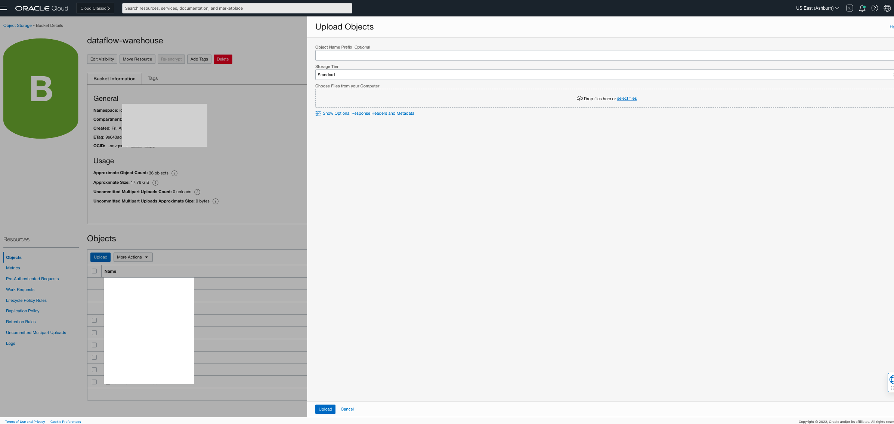
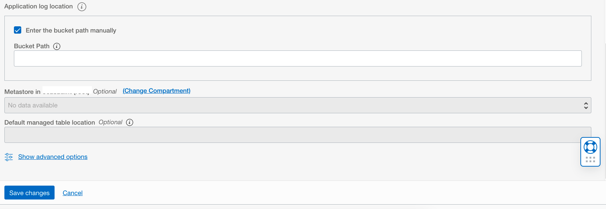

# DF: Multiple Input Sources

## Use case

```
The user wants to get and combine data from multiple input sources and merge them into a single table.
```
## Steps


Download the example [Spark application](./)

```
Upload the code to OCI Object Storage(in case of Scala or Java, upload the compiled JAR file). Note the path to the code eg. bucket dataflow-
warehouse, root folder, file name pivoting.py.
```

If there are multiple files, ensure they are all in the same folder



## Create an Application

```
Click "Create Application"
```


```
Select the number of Executors, logging location and path to the Spark application that we just created. If you are entering the path manually, it needs to
be specified in the following format: oci://dataflow-warehouse@compartmentID/multiple_input_sources.py where compartmentID is the compartment
name. Otherwise, you can use the browser to choose an object
```

Add the following to the arguments:

```
--input1 ${input1} --input2 ${ATP_OCID} --input3 ${ATP_UID} --input4 ${ATP_PASS} --input
${ADW_OCID} --input6 ${ADW_UID} --input7 ${ADW_PASS} -output ${output} --coalesce ${coalesce}
```

While choosing the ATP/ADW parameters, make sure you provide the OCIDs, UID and Password as the input of your ATP/ADW instances. These should
be the ones you specified the Username and Connections for in the code fragment as shown below.

```
val df = spark.read
.format("oracle")
.option("adbId",”autonomous_database_ocid")
.option("dbtable", "schema.tablename")
.option("user", "username")
.option("password", "password")
.load()
```

Specify path in Object Storage to store logs. These may be useful later for troubleshooting.



```
Click "Save changes" to save the Application
```


