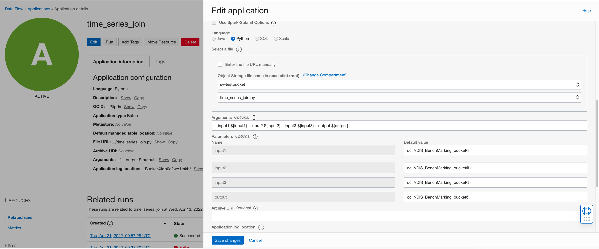

# DF: Sliding Window Aggregation

## Use case


1. You want to smooth your data points by replacing them with an average applied on a sliding window.
2. You want to use the cumulative sum of a signal over a fixed interval eg. for meter readings at equally spaced intervals of 30s, calculate the 1 min
totals before using OCI Anomaly Detection service
3. You are interested in the minimum/maximum over a sliding window

## Steps

Download the example Spark application: [sliding_window_aggregation.py](./example_code/sliding_window_aggregation.py)

Upload the code to OCI Object Storage(in case of Scala or Java, upload the compiled JAR file). Note the path to the code eg. bucket dataflow-
warehouse, root folder, file name sliding_window_aggregation.py.


If there are multiple files, ensure they are all in the same folder


## Create an Application


```
Click "Create Application"
```


```
Select the number of Executors, logging location and path to the Spark application that we just created. If you are entering the path manually, it needs to
be specified in the following format: oci://dataflow-warehouse@<compartmentID>/fixed_window_batching.py where <compartmentID> is the compartment
id. Otherwise you can use the browser to choose an object
```


Add the following to arguments:

```
--input ${input} --output ${output} --batch_size ${batch_size} --step_size ${step_size}
```
```
Here batch size needs to be calculated based on the number of signals. For example, if each row in the data has 499 signals, AD can support a total of
300k/500 = 600 rows per call. Set batch_size to 600 and run the data flow.
```

Specify path in Object Storage to store logs. These may be useful later for troubleshooting.


```
Click "Save changes" to save the Application
```

