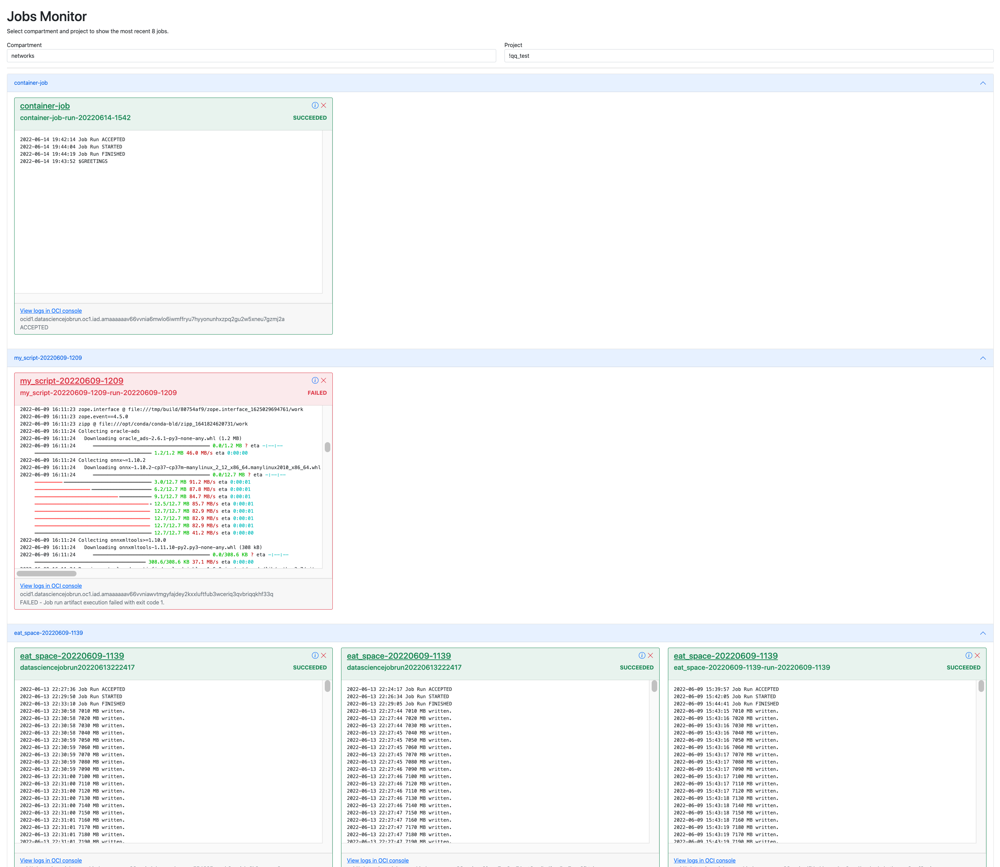

# OCI Job Monitor UI tool

Incubator project to augment the OCI console with useful functionality to support development of Data Science Jobs.

This job monitor is a Python Flask app build on top of [Oracle ADS](https://docs.oracle.com/en-us/iaas/tools/ads-sdk/latest/index.html). It allows users to monitor the status and outputs of OCI data science job runs.



User can also see the job definition in YAML:


## How to run
### Requirements
This tool requires `oci>=2.45.1` and `oracle-ads>=2.4.2`.
```
pip install oci oracle-ads flask --upgrade
```
This tool uses OCI API key for authentication. The `DEFAULT` profile in the API key will be used.

### Command Line
To start the Flask app, simply run the following command and open http://127.0.0.1:5000/ with your browser.
```
OCI_PYTHON_SDK_NO_SERVICE_IMPORTS=1 FLASK_APP=job_monitor flask run
```

The dropdown options for selecting compartment ID and project ID does not support tenancy override (e.g. ociodsccust) at the moment. For that, you will need to specify the compartment ID and project ID in the URL:
```
http://127.0.0.1:5000/<COMPARTMENT_OCID>/<PROJECT_OCID>
```
### VS Code Launch Config
The following config can be used in the VS Code `launch.json` to launch the Flask app. You may need to change the value of `FLASK_APP` to your local path if your default directory is not the root of this project.
```
{
    "name": "Jobs Monitor",
    "type": "python",
    "request": "launch",
    "module": "flask",
    "env": {
        "FLASK_APP": "job_monitor.py",
        "FLASK_ENV": "development",
        "OCI_PYTHON_SDK_NO_SERVICE_IMPORTS": "1",
        // "RECORDING": "1",
    },
    "args": [
        "run",
        "--no-debugger"
    ],
    "jinja": true
},
```

### UI Development
If you would like to develop the UI (HTML and JavaScript) without OCI authentication, you can start the app in "Recording Mode" to cache the data to your local computer.


 "mocked" version of the Flask app:
```
OCI_PYTHON_SDK_NO_SERVICE_IMPORTS=1 FLASK_APP=job_monitor_mocked flask run
```

The mocked version will use the cached data from the "mock" directory to render the web page.

The content of the "mocked" version can be generated by running the app in "Recording Mode":
```
OCI_PYTHON_SDK_NO_SERVICE_IMPORTS=1 RECORDING=1 FLASK_APP=job_monitor flask run
```
In this mode, the context of each API response is saved as pickle files in the "mock" directory. The files are named in the format of `{endpoint}/{identifier}.pickle`. This allow us to easily save real data from OCI for mocking purpose. Once the data is saved, we can simply switch to the mocked version work offline.
