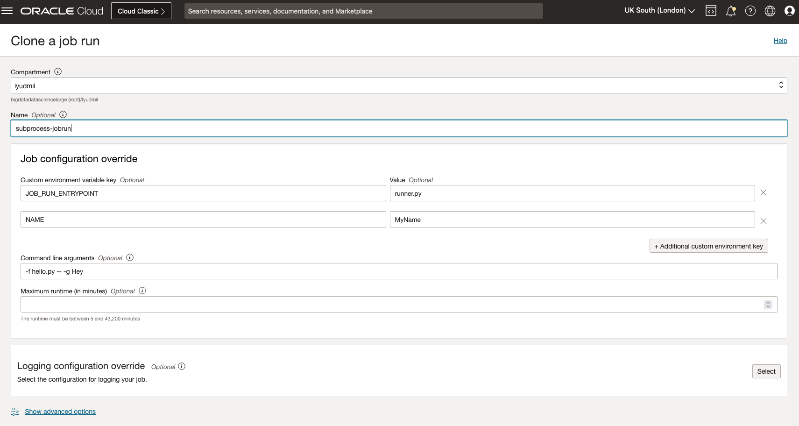

# Job Executing Code in Python Subprocess

In some cases developers execute code in Python subprocesses. If not done right however, it renders the risk that error messages are not shown in the logs (swallow) and the job does not automatically exits on code end or error. This example aims to show how subprocessing in Python could be used to install packages and execute code.

## Prerequisites

No specific pre-requirements, however we recommend you for local testing to install and run Conda environment.

## Build and Run

The code can be executed and tested locally before running as a Job on OCI Data Science Service.

### Setup Conda (optional, but recommended)

- For Linux and [Windows Subsystem for Linux](https://learn.microsoft.com/en-us/windows/wsl/about)

```bash
curl https://repo.anaconda.com/miniconda/Miniconda3-latest-Linux-x86_64.sh -o Miniconda3-latest-Linux-x86_64.sh
```

- MacOS Intel

```bash
curl https://repo.anaconda.com/miniconda/Miniconda3-latest-MacOSX-x86_64.sh -o Miniconda3-latest-MacOSX-x86_64.sh
```

- MacOS Apple Silicon

```bash
curl https://repo.anaconda.com/miniconda/Miniconda3-latest-MacOSX-arm64.sh -o Miniconda3-latest-MacOSX-arm64.sh
```

- Run the installer

Depending on your host system, get the one that much:

```bash
bash Miniconda3-latest-<Linux|MacOSX>-<x86_64|arm64>.sh
```

You may need to restart your terminal or run `source ~/.bashrc` or `~/.zshrc` to enable the conda command. Use `conda -V` to test if it is installed successfully.

- Create a new conda

```bash
conda create -n subprocess python=3.8
```

- Activate it

```bash
conda activate subprocess
```

### Run locally

After successful conda setup and activate, you can run the example directly:

```bash
python runner.py
```

First time run, if successful should show an output like:

```bash
Job code runner...
current path: /Users/lypelov/development/oci-data-science-ai-samples/jobs/tutorials/job-exec-code-with-subprocess
package py-cpuinfo does not exist, installing...
Collecting py-cpuinfo
  Using cached py_cpuinfo-9.0.0-py3-none-any.whl (22 kB)
Installing collected packages: py-cpuinfo
Successfully installed py-cpuinfo-9.0.0
File to execute: /Users/lypelov/development/oci-data-science-ai-samples/jobs/tutorials/job-exec-code-with-subprocess/get-cpu-info.py


Running command: ['/Users/lypelov/anaconda/envs/subprocess/bin/python', '/Users/lypelov/development/oci-data-science-ai-samples/jobs/tutorials/job-exec-code-with-subprocess/get-cpu-info.py']
Getting CPU info...

...
```

Notice that the next time the code is ran, if you use the same conda environment, the library `py-cpuinfo` will be detected and not installed again.

The `runner.py` runs by default the `get-cpu-info.py` in a subprocess, but you can pass `-f` to the runner.py as command line argument to specify a differen file to run.

Additionally the `hello.py` can take arguments as well and read the environment variables. For local test this could look like:

```bash
NAME=MyName python runner.py -f hello.py -- -g Hey
```

### Run as a job

Zip the code from withing the folder:

```bash
cd job-exec-code-with-subprocess
zip -r job-exec-code-with-subprocess.zip *.* -x ".*" -x "__MACOSX"
```

Create a job with the zip file.

On Job Run specify:

`JOB_RUN_ENTRYPOINT=runner.py`

If you would like to test executing the other file, `hello.py` on the job run, set as environment variables:

```ini
JOB_RUN_ENTRYPOINT=runner.py
NAME=MyName
```

... and command line arguments:

```ini
-f hello.py -- -g Hey 
```

