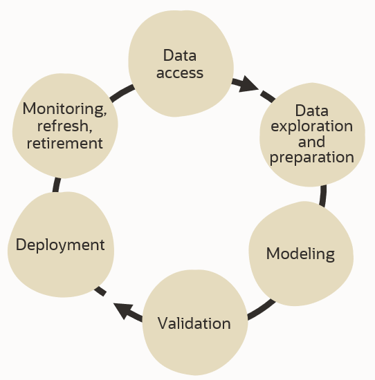
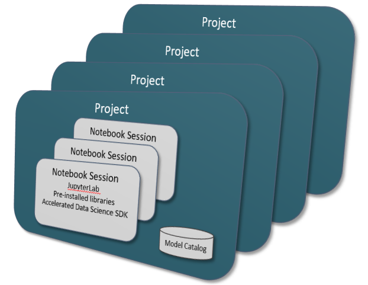
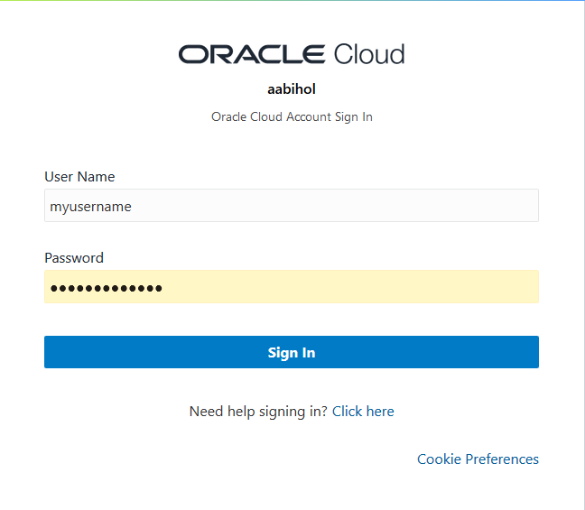
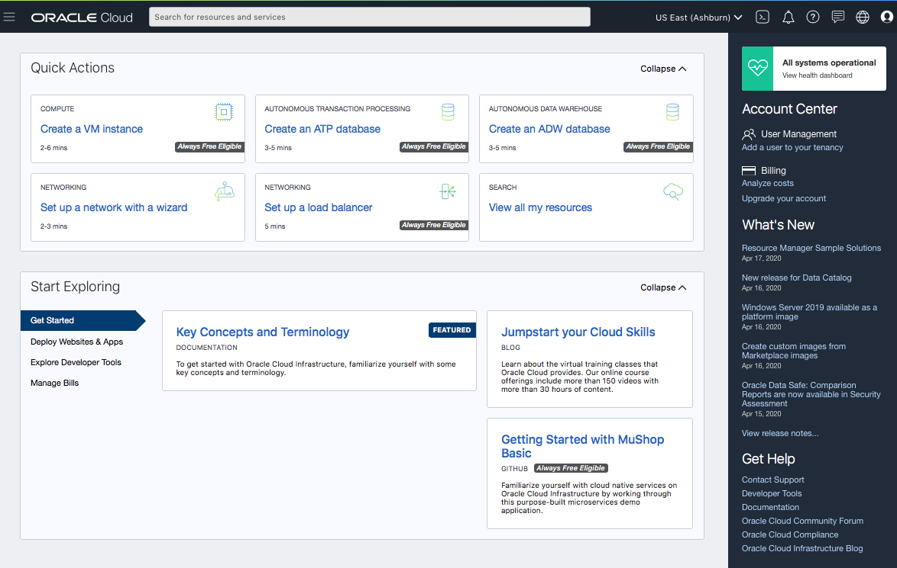
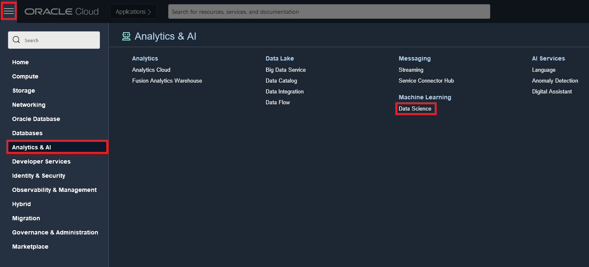
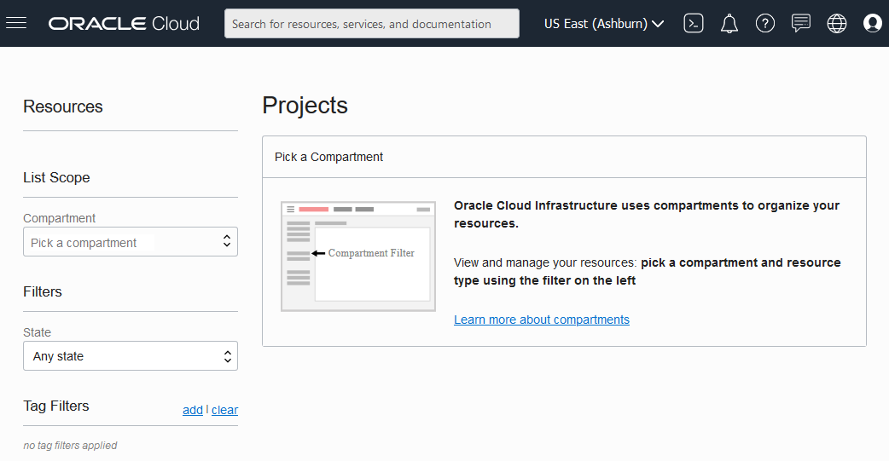
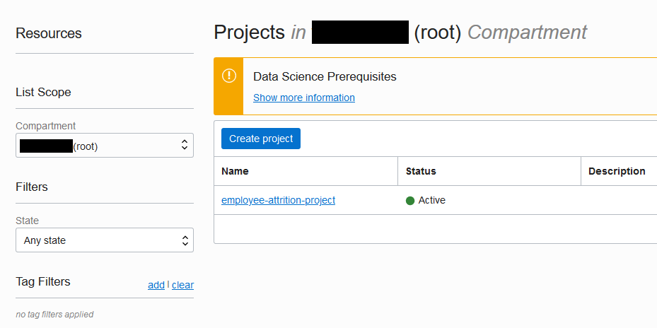

# Lab 1 - Introduction, Sign-in, and Navigation

## OCI Data Science

Oracle Cloud Infrastructure (OCI) Data Science is a fully managed cloud service for data science teams to build, train, manage, and deploy machine learning models.

OCI Data Science:
* Provides data scientists with a collaborative, project-driven workspace.
* Enables self-service access to managed infrastructure for data science workloads.
* Includes Python-centric tools, libraries, and packages developed by the open source community.
* Includes the [Oracle Accelerated Data Science Library](https://docs.cloud.oracle.com/iaas/tools/ads-sdk/latest/index.html), which supports the end-to-end life cycle of predictive models with:
    * Data acquisition, profiling, preparation, and visualization
    * Feature engineering
    * Model training (including Oracle AutoML)
    * Model evaluation, explanation, and interpretation (including Oracle MLX)
    * Model deployment
* Integrates with the rest of Oracle Cloud Infrastructure including Data Flow, Autonomous Data Warehouse, Object Storage, and Functions.
* Helps data scientists concentrate on methodology and domain expertise to deliver more models to production.

## Workshop Overview
   

In this workshop you will experience the full lifecycle for a data scientist using OCI Data Science. Once you get connected and oriented to Oracle Cloud, you will use a Jupyter notebook to access data, explore and characterize the data, build and train a model, evaluate and validate, then catalog the model. You will then deploy the model and exercise it.

This is the agenda:
* Lab 1 - Introduction, Sign-in, and Navigation
	* OCI Data Science Concepts
	* Sign-in to OCI Cloud Environment
* Lab 2 - (REMOVED)
* Lab 3 - Build a Model Using Provided Notebook
	* Open a notebook session
	* Install a conda environment
	* Open a notebook to build an Python model
* Lab 4 - Deploy and Test a Model
	* Create Model Deployment
	* Test Deployed Model
* Lab 5 - Shutting down a notebook session
	* Deactivate notebook
	* Terminate notebook

Estimated Total Workshop time: 2 hours

Estimated Lab 1 time: 10 minutes

### Objectives
In this first lab, you will:
* Become familiar with concepts and terminology used in the Data Science service
* Become familiar with the OCI Console and how to access the Data Science service
* Create a project in the Data Science service

### Prerequisites

* An Oracle Cloud Infrastructure tenancy and login, configured for using OCI Data Science

## **STEP 1:** OCI Data Science Concepts

Review the following concepts and terms to help you get started with the Data Science service.
* **Project**: Projects are collaborative workspaces for organizing and documenting Data Science assets, such as notebook sessions and models. In this workshop, each user has their own project.
* **Notebook Session**: Data Science notebook sessions are interactive coding environments for building and training models. Notebook sessions come with many pre-installed open source and Oracle developed machine learning and data science packages. In this workshop, each user has a notebook session containing several notebooks.
* **Accelerated Data Science SDK**: The Oracle Accelerated Data Science (ADS) SDK is a Python library that is included as part of OCI Data Science. ADS has many functions and objects that automate or simplify many of the steps in the data science workflow, including connecting to data, exploring and visualizing data, training a model with AutoML, evaluating models, and explaining models. In addition, ADS provides a simple interface to access the Data Science service's model catalog and other OCI services including Object Storage.
* **Model**: Models define a mathematical representation of your data and business processes.
* **Model Catalog**: The model catalog is a place to store, track, share, and manage models.
* **Conda environment**: Condas are collections of specific libraries and other resources that simplify library management. They are used to run notebooks and deployed models.

  

## **STEP 2:** Get Started - Sign-in to your Oracle Cloud environment
1. You will use the **user name** and **password** that you configured for your tenancy.

1. Launch the Oracle Cloud Console in your web browser using the **link provided in your cloud account registration email**. [Launch Console](https://cloud.oracle.com/?region=us-ashburn-1&provider=OracleIdentityCloudService)
  

1. Enter your username and password into the corresponding fields and click *Sign In*.

1. Once you successfully signed in, you will be presented with the Oracle Cloud console homepage.
  

1. The navigation menu is accessed by clicking the 3-bar icon in the upper left corner of the page. Click the **Navigation Menu icon** in the upper left, select **Analytics & AI** from the menu, then select **Data Science**
	

1. You should now be viewing the Data Science projects page. In this step you will familiarize yourself with the page. This lists projects that have been created in the selected compartment. Compartments allow resources to be grouped and isolated for access control and management. The list of projects can also be filtered by state and/or by tags.
  

1. For this lab, you will use the default root compartment.
  

1. Notice you already have a project called **employee-attrition-project**. Click the project name.

1. The project page lists project information along with resources contained in the project such as **notebook sessions**, **models**, **jobs**, and **model deployments**. Your project should already contain a notebook session.
  

**You may proceed to the next lab.**
