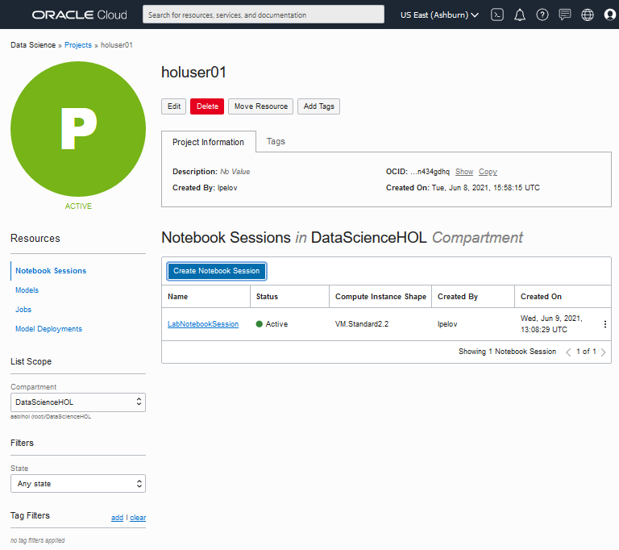
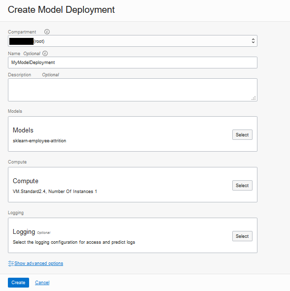
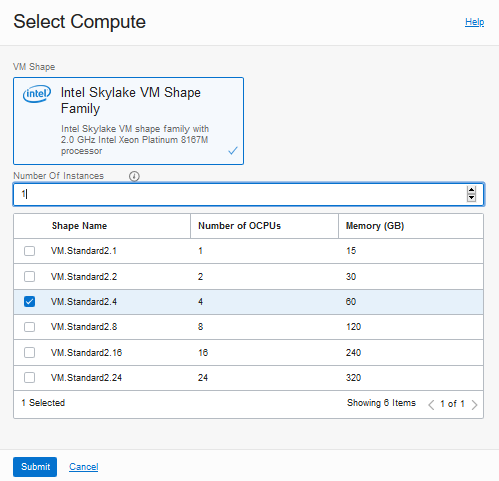
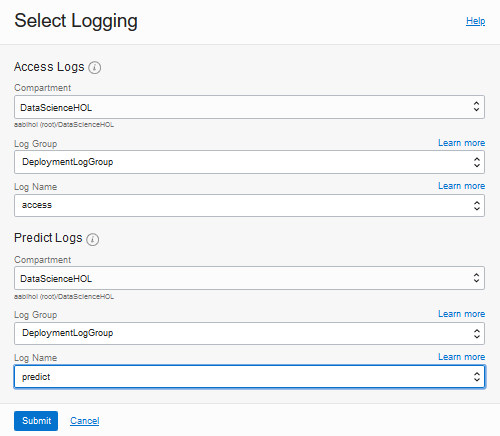

# Lab 4 - Deploy A Model and Invoke It

## Introduction

This lab will guide you through deploying a cataloged model from the OCI Console and then invoking it.

Estimated lab time: 15 minutes

### Objectives
In this lab you will:
* Learn how to deploy a model from the console
* Invoke the model endpoint

### Prerequisites
* You are signed-in to Oracle Cloud
* You have navigated to Data Science
* You have selected the **DataScienceHOL** compartment
* You have opened the project you created in Lab 1
* You have a notebook session in your project
* You have a model stored in the model catalog

## **STEP 1:** Deploy the model
Now we're going to deploy the model to its own compute instance so that it can be used. This will take the model from the catalog and create a runtime version of it that's ready to receive requests.

1. Confirm you have completed all the prerequisites and are viewing your Data Science project.
    

1. Select the browser tab for your project. If the login has expired, sign-in again and navigate to the Data Science project associated with your user name.

1. Under *Resources*, select **Models** to see the list of models in your model catalog.
    

1. Find the row containing TODO **sklearn-employee-attrition**. On the right end of the row, click the 3-dot icon to open a pop-up menu.

1. In the pop-up menu, click **Create Deployment**. The *Create Model Deployment* dialog opens.
    

1. In the *Create Model Deployment* dialog, configure the fields as described below.
      
    - Ensure *Compartment* is set to **DataScienceHOL**.
    - Enter *Name* as **MyModelDeployment**
    - Ensure *Models* is set to TODO **sklearn-employee-attrition**
    - In the *Compute* box, click **Select**.
    - Enter **1** for *Number of Instances* and check **VM.Standard2.4**. Then click **Submit**.
    

    - In the *Logging* box, click **Select**.
    - For both *Log Group* fields, select **DeploymentLogGroup**. For *Access Logs Log Name*, select **access**. For *Predict Logs Log Name*, select **predict**. Then click **Submit**
      
    - Click **Submit** in the Create Model deployment dialog. It takes about 10 minutes for the deployment to be provisioned. Wait for the model to be deployed.

> **Note** - You just deployed the model through the OCI Console, but you can also deploy a model using python code in a notebook. The ADS library provides functions to do this. See [Model Deployment with ADS](https://docs.oracle.com/en-us/iaas/tools/ads-sdk/latest/user_guide/model_deployment/model_deployment.html) for more information.

1. When the model is deployed, copy the HTTP endpoint URI to your clipboard (to be used in the next step) TODO

## **STEP 2:** Invoke the deployed model
Now that the model is deployed, we will go back to the notebook and invoke its HTTP endpoint.

1. If your **notebook session tab** in your browser is still open from the previous lab, then view it. Otherwise, follow these steps to return to it.
  1. Under Resources, click **Notebook Sessions**.

  1. Click on the notebook session named **LabNotebookSession** to open it.

  1. Click on **Open**. It will open in a separate browser tab. If prompted to sign-in, provide your Oracle Cloud credentials.
  

1. Ensure you are viewing the browser tab/window displaying *LabNotebookSession*.  

1. In the notebook, scroll down to the cell that says to ***Invoke the Model HTTP Endpoint***.

1. In one the code block below, find the statement:
~~~
# Replace with the uri of your model deployment:
uri = ''
~~~

1. **Paste** your deployed model endpoint URI into the statement between the single quote marks.

1. Execute the remaining code blocks

1. TODO Review the json inputs and outputs and see that your deployed model returned an attrition prediction for the submitted input data.

Congratulations! You have successfully built, trained, cataloged, deployed, and invoked a machine learning model with OCI Data Science. **You can [proceed to the next lab](#next).**
