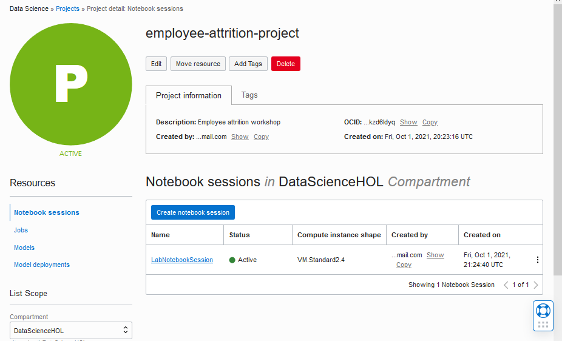
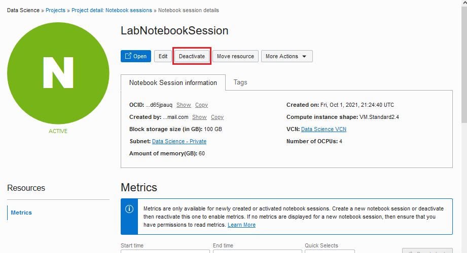
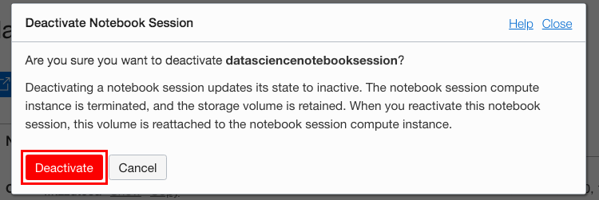
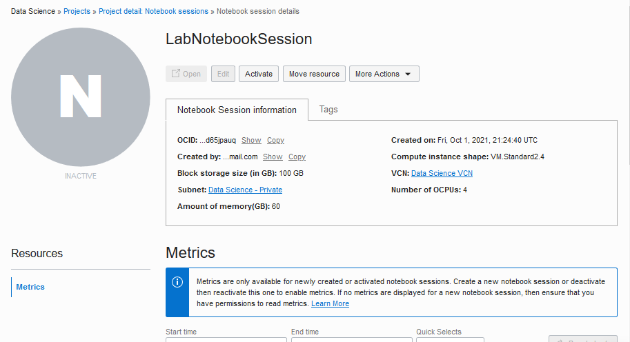
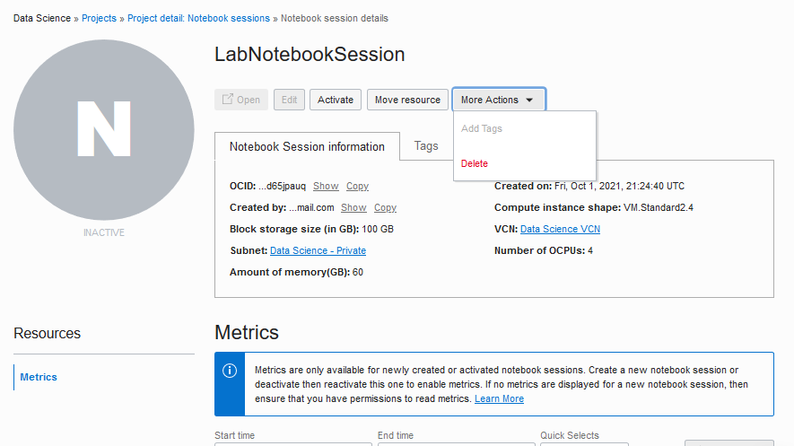
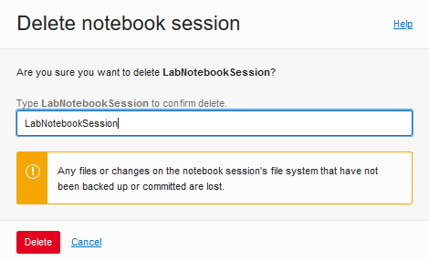
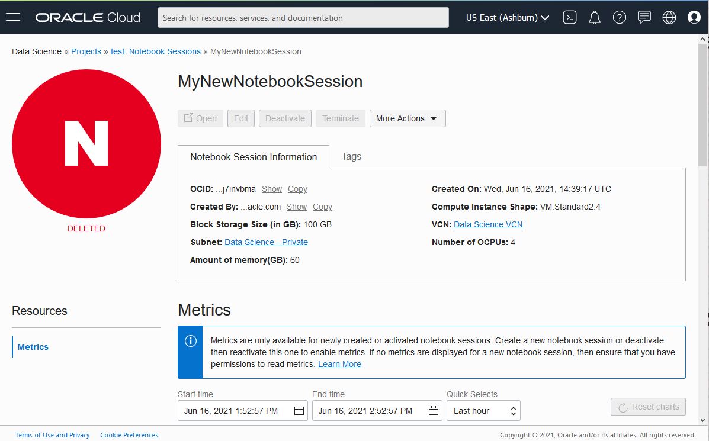

# Lab 5 - Shutting Down a Notebook Session

## Introduction

When a notebook session is in an active state, there is a boot volume, block storage, and compute attached to it. When the notebook is not being used it is possible to detach the computing resource and thus reduce costs. There are two methods for shutting down a notebook session.

1. If a notebook session is **deactivated**, then the underlying computing resource is shut down and the boot volume and block storage are detached. However, the block storage, which is mounted at ``/home/datascience``, is persisted for later use, so save all your work there before deactivating. Also, any conda environment used by the notebook session will be preserved. The boot volume is *not* persisted. Deactivated notebook sessions can be activated again and the block volume is automatically reattached. During activation, you can change the compute shape, increase the size of the block volume, change the VCN, and the subnet.

1. If the notebook session and its block storage are no longer needed, then the notebook session can be **terminated**. Terminating a notebook session releases the underlying compute, boot volume and block storage. Since the boot volume and block storage are not persisted, any data on these volumes will be lost. It is not possible to reactivate a terminated notebook session.

*Estimated Lab Time*: 5 minutes

### Objectives
In this lab, you will:
* Learn the different methods of shutting down a notebook session
* Understand the differences between deactivating and terminating a notebook session
* Become familiar with the steps needed to deactivate and terminate notebook sessions

### Prerequisites
* You are signed-in to Oracle Cloud
* You have navigated to Data Science
* You have opened the Data Science project

## STEP 1 - Deactivating Notebook Sessions
1. Confirm you have completed all the prerequisites and are viewing your Data Science project.
    

1. Under *Resources*, select **Notebook Sessions** if not already selected.

1. Click the name of **LabNotebookSession** notebook session (created in a previous lab) to open the Notebook Session page.

1. Click **Deactivate**.
    

1. Click **Deactivate** to confirm the deactivation. The status of the notebook session changes to **Updating** and then **Inactive** and this takes 1-2 minutes.
    

## STEP 2 - Deleting Notebook Sessions
> **Note - if you want to preserve your notebook session for further study, do not proceed with this step.** You can reactivate the notebook session whenever you want by using the **Activate** button.

If you are going to delete a notebook session but want to preserve the contents of the boot volume and attached block volume, you must back them up before the notebook session is deleted. For example, copy the files to an object storage bucket, or commit and push changes to a Git repository outside the notebook session. All content in the notebook session’s boot volume and attached block volume are deleted when the notebook session is deleted.

1. You should be viewing the inactive notebook session named **LabNotebookSession** and you have the choices to activate or delete it.
    

1. Click **More Actions** then **Delete**.
    

1. Enter **LabNotebookSession** to confirm and click **Delete**.
    

1. The notebook session status changes to **Deleting** and then **Deleted** in about a minute.
    

    

**Congratulations, you have successfully completed the workshop!**
