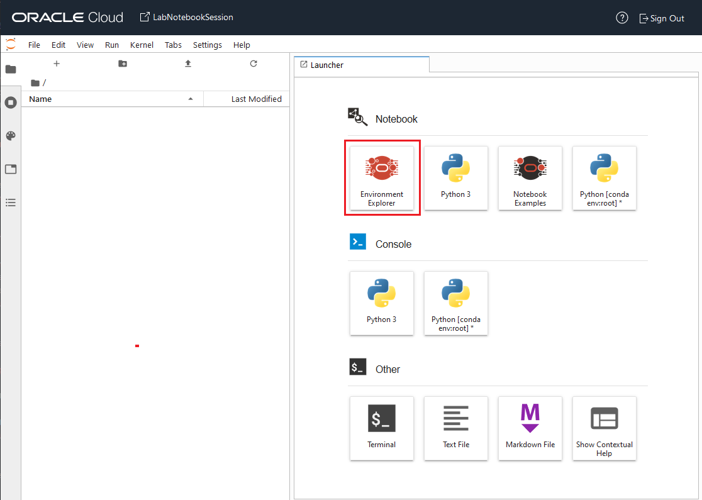
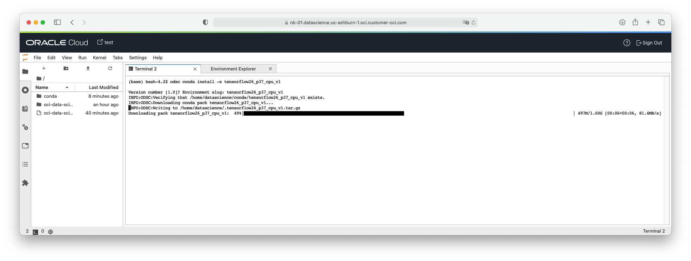
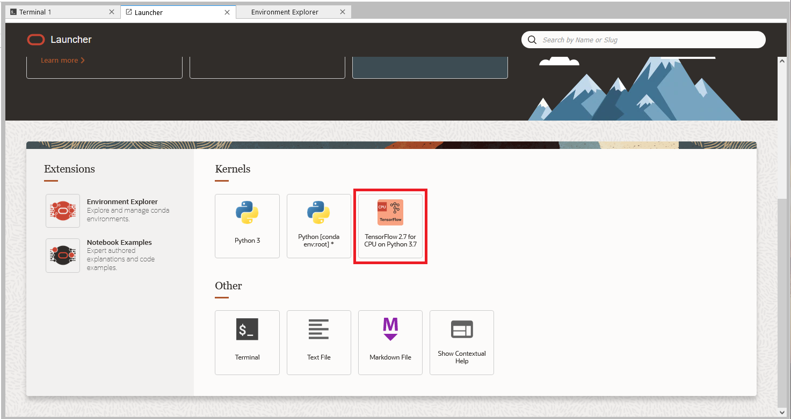

# Lab 2 - Installing a Conda Environment

## Introduction

This lab will guide you through the steps of how to install and use conda environments within the Data Science Notebooks

### What are Conda Environments?

You can think of a [Conda Environment](https://docs.conda.io/projects/conda/en/latest/index.html) as somewhere between a Docker image and a Python virtual environment. Conda is like a virtual environment that lets you run Python processes in different environments with different versions of the same library. It’s more powerful than virtualenv, because it also manages different versions of Python that aren’t installed system-wide, lets you upgrade libraries, and supports the installation of packages for R, Python, Node.js, Java, and so on.

The process of building Conda Environments is simpler and faster than building Docker images. For many ML and AI use cases, Conda Environments offer the right level of isolation and flexibility. Moreover you can run multiple conda environments in parallel in the same notebook session. You can, for example, write and execute notebook files in different conda environments and within the same notebook session.

Conda Environments give you the following capabilities:

* You can install Python libraries from the different Conda channels such as conda-forge, from a pypi service, or directly from a third-party version control provider such as github.com.

* Conda Environments are also portable through the conda-pack tool. You can archive them in an Object Storage bucket, for example, or shipped across platforms and operating systems.

* You can access different Conda Environments as different notebook kernels in JupyterLab. So, data scientists and machine learning engineers can simultaneously execute different notebooks in different kernels with potentially conflicting sets of dependencies.

Estimated lab time: 10 minutes

### Objectives

In this lab you will:

* Learn how to use the Conda Environment Explorer tool in the notebook session
* Learn how to install a conda environment in your notebook session
* Leanr how to run a notebook in a conda environment kernel

### Prerequisites
* You have successfully completed labs 0 and 1. 

## **STEP 1:** Open a Notebook Session

1. Click on the notebook session you created during Lab 1 or Lab 0. 

1. CLick on **Open**. It will open in a separate browser tab. If prompted to sign-in, provide your Oracle Cloud credentials.
    

1. Ensure you are viewing the browser tab/window displaying
    

This is JupyterLab. It can be seen that the screen is split into two sections. By default, the left side has the file browser open but it can change based on what navigation icons are selected on the far left side of the screen. The right side of the screen contains the workspace. It will have a notebook, terminal, console, launcher, notebook examples, etc..

There is a menu across the top of the screen. For this lab, the most interesting menu item is *Run*. It will allow you to execute code cells in the notebook. It is recommended that you manually execute the cells one at a time as you progress through the notebook. It is important that you execute them in order. To do this from the keyboard, press *shift + enter* in a cell and it will execute it and advance to the next cell. Alternatively, you can run all of the cells at once. To do this, click on Run then "Run All".

## **STEP 2:** Installing Your First Conda Environment

The Environment Explorer is an extension in JupyterLab that provides an interface to manage the lifecycle of conda environments. A Conda Environment is a collection of libraries, programs, components and metadata. Think of them as halfway between a Python virtual environment and a Docker image. In the notebook session you can install a series of pre-built conda environments (Data Science Environments) or create and publish your own conda environments from a notebook session. Published conda environments are the ones that you create or modify and want to share among team members or reuse in Jobs or Model Deployments. In addition to the Environment Explorer, the notebook session also comes with the `odsc conda` CLI. The `odsc` CLI lets you manage the lifecycle of conda environments. 

Before you can use a conda environment in your notebook session, you need to install it first. You will install a pre-built Data Science Conda Environment. 

  1. In the *Launcher* tab, click **Environment Explorer**
    

  1. In the Environment Explorer tab, select the **Data Science Conda Environment** filter button, select **CPU** architecture filter, then scroll down until you find the **TensorFlow 2.6 for CPU Python 3.7** conda. (If you see no results, use the refresh button on the right side of the filter bar of the Environment Explorer.)
    

  1. Click on the caret on the right side, copy the install command 
    

  1. Go back to the *Launcher* tab and select **Terminal** to open a terminal window.

  1. **Paste the command** into the terminal window and hit **Return** to execute it. 
     The command that you previously copied is:  
      ```
      odsc conda install -s tensorflow26_p37_cpu_v1 
      ```

  1. You will receive a prompt related to what version number you want. Press `Enter` to select the default.
  
  

It takes about 3-5 minutes for the conda package to be installed.

## **STEP 3** Confirm that the Conda Environment is Installed

You can confirm that the conda environment has been successfully installed by going back to the launcher tab and see that a new kernel has been create with the slugname of the conda environment: 
 

**Congratulations! You can proceed to the next lab.**

# A few Useful References On Conda Environments

 * [Our Service Documentation on Conda Environments](https://docs.oracle.com/en-us/iaas/data-science/using/conda_understand_environments.htm)
 * [A YouTube Screencast on Installing and Publishing Conda Environments in OCI Data Science](https://www.youtube.com/watch?v=j6wVqpn6lqg&list=PLKCk3OyNwIzv6CWMhvqSB_8MLJIZdO80L&index=9&t=4s)
 * [A YouTube Screencast on Creating Your Own Conda Environment From Scratch](https://www.youtube.com/watch?v=3_qyf_GJUuM&list=PLKCk3OyNwIzv6CWMhvqSB_8MLJIZdO80L&index=13)
 * [Blog Post Announcing the new Conda Environments Feature in Notebook Sessions](https://blogs.oracle.com/ai-and-datascience/post/new-conda-environment-feature-available-in-oracle-cloud-infrastructure-data-science)


