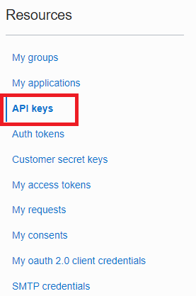

# Lab 3: Access OCI Vision with REST APIs

## Introduction

In this lab session, we will show you how to access OCI Vision using POSTMAN.

Postman is a GUI-based REST API invocation tool that is very popular among developers.

*Estimated Lab Time*: 10 minutes

### Objectives:
* Learn how to access Vision Service through REST APIs.

### Prerequisites:
* Basic knowledge of REST API calls.
* Postman GUI in your local setup. If you don't have POSTMAN, please download it from [POSTMAN](https://www.postman.com/downloads/)

## **TASK 1:** Add Sample Images to Object Storage

1. Download the [sample images](./Sample-Images).

2. Login to the OCI Console and navigate to your Object Storage Buckets

  
  
3. Create a new bucket called "pidaydemo".

4. Create a new folder in the "pidaydemo" bucket called "sample-images".

5. Upload the sample images to the "sample-images" folder.

## **TASK 2:** Setting Up Postman for OCI REST APIs
We have put together a Postman Collection and Environment to help you get started with calling the Vision REST APIs.

1. Install [POSTMAN](https://www.postman.com/downloads/).

1. Import the Vision Collection into Postman

Download the [Vision API Collection](https://www.postman.com/oracledevs/workspace/oracle-cloud-infrastructure-rest-apis/overview) and import the Collection into Postman using the 'Import' button at the top.
   
1. Import the OCI Credentials Environment into Postman

Download the [OCI Credentials Environment](https://www.postman.com/oracledevs/workspace/oracle-cloud-infrastructure-rest-apis/environment/29850-eab82db8-e9a1-4200-9f39-de10b4a0f371) and import the Environment into Postman using the 'Import' button at the top.

Make sure to set OCI Credentials as the active environment.

1. Set the Variables

Open and edit the newly imported environment (OCI Credentials). Set the following variables:

   * tenancy_ocid
      1. To get the tenancy_ocid, open the OCI Console, select **Profile**, select **tenancy**
         
      1. Copy the **OCID** on this page and add it to your Postman OCI Crednetials.
   * user_ocid
      1. To get the user_ocid, open the OCI Console, select **Profile**, select **My Profile**
         
      1. Copy the **OCID** on this page and add it to your Postman OCI Crednetials.
   * fingerprint
      1. To get the fingerprint, open the OCI Console, select **Profile**, select **My Profile**
         
      1. Select **API Keys**
         
      1. Select **Add API Key**
      1. Select **Generate API key pair**
      1. Select **Download private key**. Remember the location where you save the private key. 
      1. Select **Add**
      1. Select **Close**
      1. Copy the fingerprint for the API Key that you just created and add it to the Postman Environment. 
   * private_key
      1. Navigate to the private key that you downloaded when getting the fingerprint. Copy it's contents to the Postman Environment.
   * region
      1. Add a region to the Postman Environment. Ex: us-phoenix-1
   * compartment_ocid
      1. Choose a compartment where you have access to the OCI Vision service.

**Make sure to set both Initial Value and Current Value of the variables (set both as the same value).**

1. Click the Save button to commit your changes to the environment.

## **TASK 3:** Invoke Vision OCI REST APIs

##TODO

[Proceed to the next lab](#next).
