# Lab 3: Access OCI Vision with REST APIs

## Introduction

In this lab session, we will show you how to try out the OCI Vision REST API using POSTMAN.
Postman is a GUI-based REST API  tool that is very popular among developers.

*Estimated Lab Time*: 10 minutes

### Objectives:
* Learn how to access Vision Service through REST APIs.

### Prerequisites:
* You created the "pidaydemo" bucket in your tenancy's object storage and uploaded images for lab 3

## **TASK 1:** Setting Up Postman for OCI REST APIs
We have put together a Postman Collection and Environment to help you get started with calling the Vision REST APIs and you'll import both of those into you local POSTMAN instance.

1. Install [POSTMAN](https://www.postman.com/downloads/) to your local computer if you don't already have it. Once installed, run it.

1. Use this [link](https://www.postman.com/oracledevs/workspace/oracle-cloud-infrastructure-rest-apis/overview) to download the **Vision API Collection**. The link opens Postman on the web. Select **Collections** on the left side of the screen. Hover over *VisionService API* and click the 3 dots to open the popup menu. Select **Export** to export the collection file and save it to your local computer.
  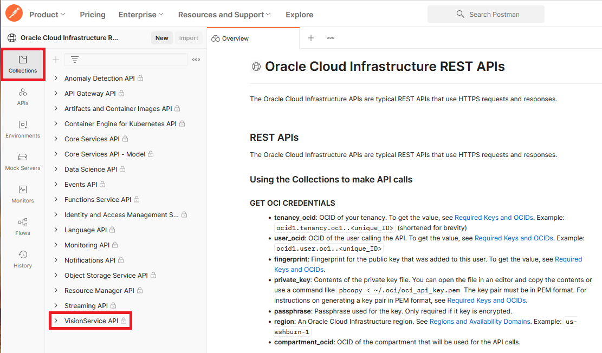

1. Import the Vision API Collection file (**VisionService API.postman_collection.json**) into Postman running on your local machine by selecting **Collections** on the left side of the  screen then clicking the **Import** button at the top.

  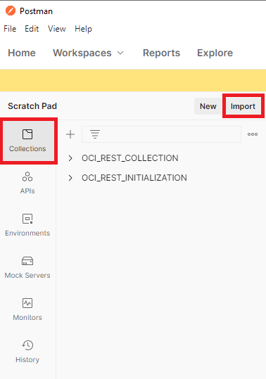

1. In the *Import* dialog, click the **Upload Files** button and select the json file you exported in the previous step.
  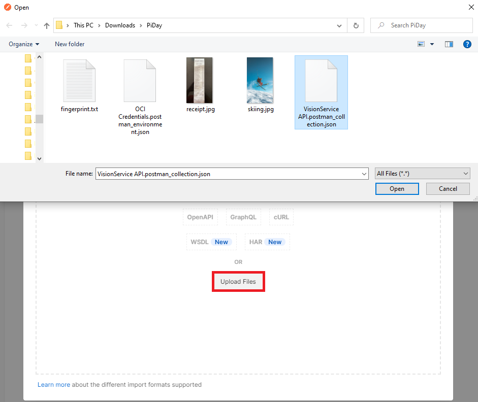

1. Use this [link](https://www.postman.com/oracledevs/workspace/oracle-cloud-infrastructure-rest-apis/environment/29850-eab82db8-e9a1-4200-9f39-de10b4a0f371) to download the **OCI Credentials Environment**. The link opens Postman on the web. Select **Environmments** on the left side of the screen then select **OCI Credentials**. One the right side of the screen find the 3 dots and click it to open a popup menu. On the menu click **Export** to export the credentials file and save it to your local computer.
  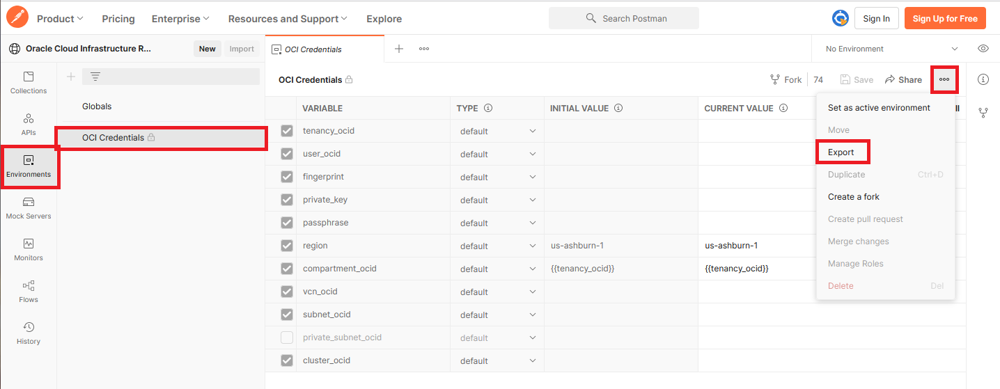

1. Import the OCI Credentials file (**OCI Credentials.postman_environment.json**) into Postman running on your local machine by using the **Import** button at the top.
  

1. In the *Import* dialog, click the **Upload Files** button and select the json file you exported in the previous step.
  

1. Set OCI Credentials as the active environment by **clicking the check** next to *OCI Credentials*
  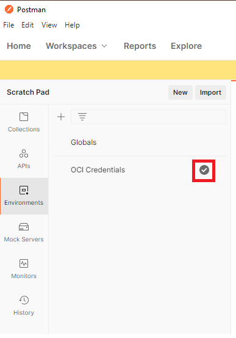

Now we will set the variables in the OCI Credentials in your local POSTMAN and you'll obtain the needed values from your OCI tenancy.

1. Open the newly imported environment in POSTMAN: OCI Credentials. You'll see it contains multiple variables with empty values. We need to set 6 of those variables.


#### tenancy_ocid ####

1. To get the **tenancy_ocid**, open the OCI Console, click the **Profile** icon in the upper right corner, then select **Tenancy: *name***
  

1. Copy the **OCID** on this page and add it to your Postman OCI Credentials in the **tenancy_ocid CURRENT VALUE** field.
  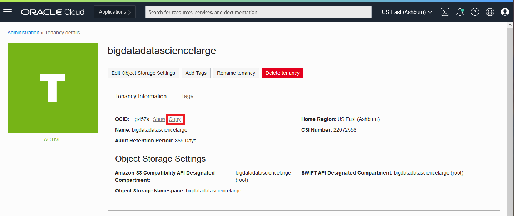

  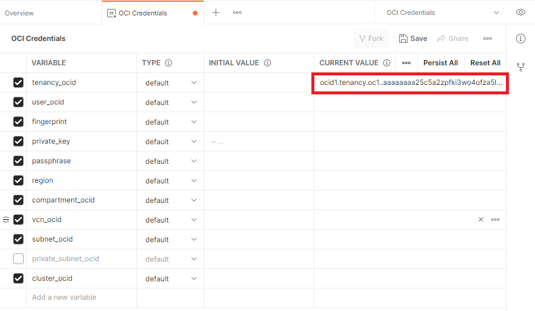

#### user_ocid ####
1. To get the **user_ocid**, go back to the OCI Console, click the **Profile** icon, then select **your user name**
  

1. The *User Details* page opens. Copy the **OCID** on this page and add it to your Postman OCI Credentials in the **user_ocid CURRENT VALUE** field.
  

  

#### fingerprint & private_key####

1. Open the OCI Console, click the **Profile** icon, then select **your user name**.

  

2. The User Details page opens. Under Resources, on the lower left side of the page, select **API Keys**

  

3. Click the **Add API Key** button

  

4. The Add API Key dialog box opens. Select option: **Generate API Key Pair**

  

5. Click the **Download Private Key** button and save the file to you local computer. Remember the location where you saved the private key file (*username-date*.pem).

  

6. Click the **Add** button in the *Add API Key* dialog. The *Configuration File Preview* dialog opens.

7. Click **Close** on the *Configuration File Preview* dialog

  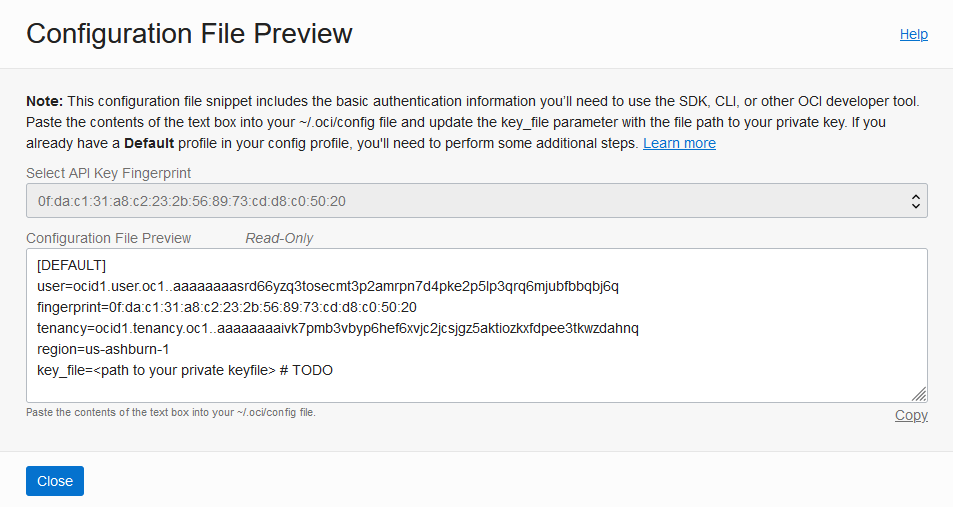

7. Copy the **fingerprint** for the API Key that you just created and add it to the **fingerprint CURRENT VALUE** field of the Postman Environment.
  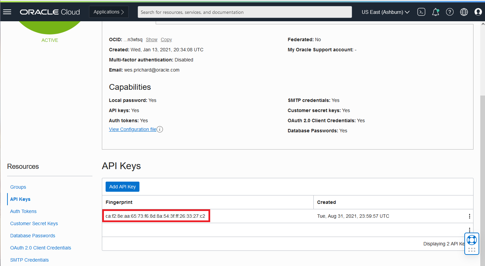

  

8. On your local computer, navigate to the **private key file (*username-date*.pem)** that you downloaded when getting the fingerprint. Open it in a text editor, copy it's contents, and paste them into the **private_key CURRENT VALUE** field of the Postman Environment.
  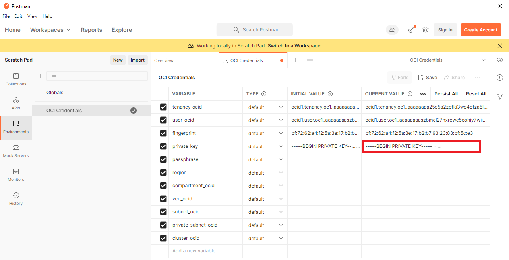

#### region ####

1. In the OCI Console, note the **home region** displayed near the upper right corner of the page (e.g. US East (Ashburn)). Find the corresponding **Region Identifier** displayed in the table below (e.g. us-ashburn-1) and copy and paste it into the **region CURRENT VALUE** field of the Postman Environment. Overwrite the default value if your region is different.

  

| Region Name |	Region Identifier |	Region Location |
|-------------|-------------------|-----------------|
|Australia East (Sydney) |	ap-sydney-1 |	Sydney, Australia |
|Australia Southeast (Melbourne) |	ap-melbourne-1 |	Melbourne, Australia |
|Brazil East (Sao Paulo) |	sa-saopaulo-1 |	Sao Paulo, Brazil |
|Brazil Southeast (Vinhedo) |	sa-vinhedo-1 |	Vinhedo, Brazil |
|Canada Southeast (Montreal) |	ca-montreal-1 |	Montreal, Canada |
|Canada Southeast (Toronto) |	ca-toronto-1 |	Toronto, Canada |
|Chile (Santiago) |	sa-santiago-1 |	Santiago, Chile |
|France South (Marseille) |	eu-marseille-1 |	Marseille, France |
|Germany Central (Frankfurt) |	eu-frankfurt-1 |	Frankfurt, Germany |
|India South (Hyderabad) |	ap-hyderabad-1 |	Hyderabad, India |
|India West (Mumbai) |	ap-mumbai-1 |	Mumbai, India |
|Israel Central (Jerusalem) |	il-jerusalem-1 |	Jerusalem, Israel |
|Italy Northwest (Milan) |	eu-milan-1 |	Milan, Italy |
|Japan Central (Osaka) |	ap-osaka-1 |	Osaka, Japan |
|Japan East (Tokyo) |	ap-tokyo-1 |	Tokyo, Japan |
|Netherlands Northwest (Amsterdam) |	eu-amsterdam-1 |	Amsterdam, Netherlands |
|Saudi Arabia West (Jeddah) |	me-jeddah-1 |	Jeddah, Saudi Arabia |
|Singapore (Singapore) |	ap-singapore-1 |	Singapore,Singapore |
|South Africa Central (Johannesburg) |	af-johannesburg-1 |	Johannesburg, South Africa |
|South Korea Central (Seoul) |	ap-seoul-1 |	Seoul, South Korea |
|South Korea North (Chuncheon) |	ap-chuncheon-1 |	Chuncheon, South Korea |
|Sweden Central (Stockholm) |	eu-stockholm-1 |	Stockholm, Sweden |
|Switzerland North (Zurich) |	eu-zurich-1 |	Zurich, Switzerland |
|UAE Central (Abu Dhabi) |	me-abudhabi-1 |	Abu Dhabi, UAE |
|UAE East (Dubai) |	me-dubai-1 |	Dubai, UAE |
|UK South (London) |	uk-london-1 |	London, United Kingdom |
|UK West (Newport) |	uk-cardiff-1 |	Newport, United Kingdom |
|US East (Ashburn) |	us-ashburn-1 |	Ashburn, VA |
|US West (Phoenix) |	us-phoenix-1 |	Phoenix, AZ |
|US West (San Jose) |	us-sanjose-1 |	San Jose, CA |

  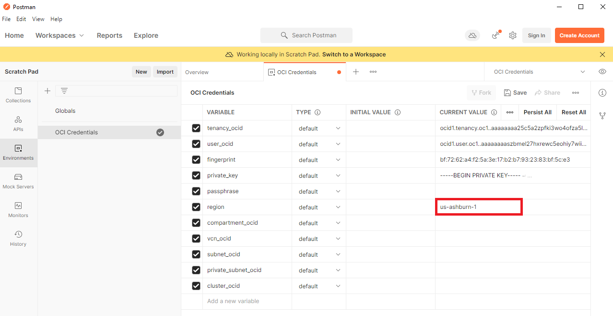
The information in the table is found here: https://docs.oracle.com/en-us/iaas/Content/General/Concepts/regions.htm

#### compartment_ocid ####

1. Go to the OCI Console and use the hamburger menu to select **Identity & Security**, then, under *Identity*, select **Compartments**.
  

1. The *Compartments* page is displayed and lists all of the compartments. If you are using a new trial tenancy, you will have a root compartment and *ManagedCompartmentForPaaS*. **Click the name of the compartment** **(root)** you configured in Lab 2 to access the OCI Vision service.

1. On the *Compartment details* page, click **Copy** next to the compartment OCID.
  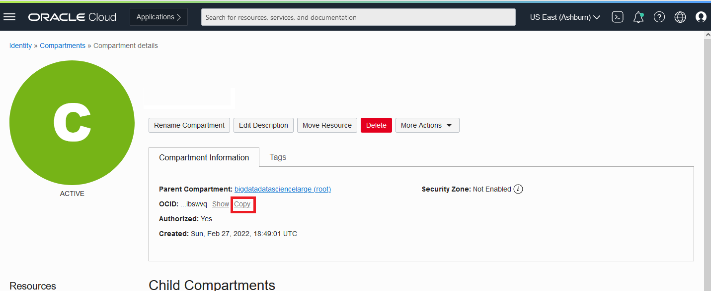

1. Paste the OCID into the **compartment_ocid CURRENT VALUE** field of the Postman Environment.
  

#### save ####
1. In POSTMAN, click the **Persist All** button to save the Current Value to the Initial Value.
  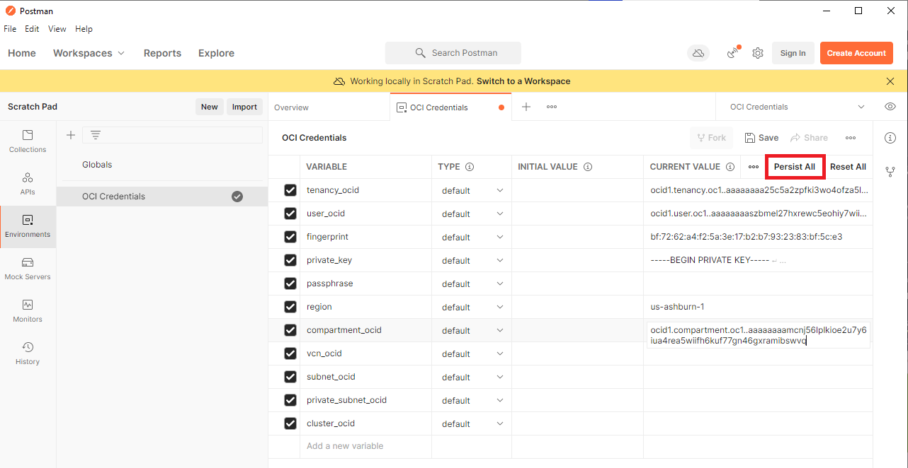

1. In POSTMAN, click the **Save** button to save all of the OCI Credentials that you just entered.
  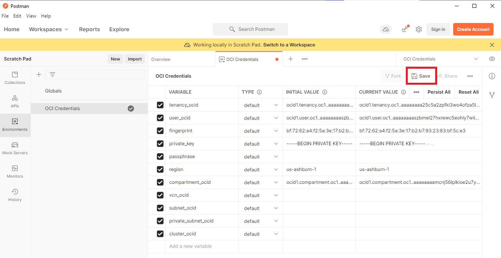

## **TASK 2:** Invoke the Image Analysis REST API

In this task you'll call the Image Analysis synchronous REST API.

1. In POSTMAN, select **Collections**, then expand *Vision Service API* then *actions* then click **perform image analysis**. Then select the **Body** tab under *POST*.
  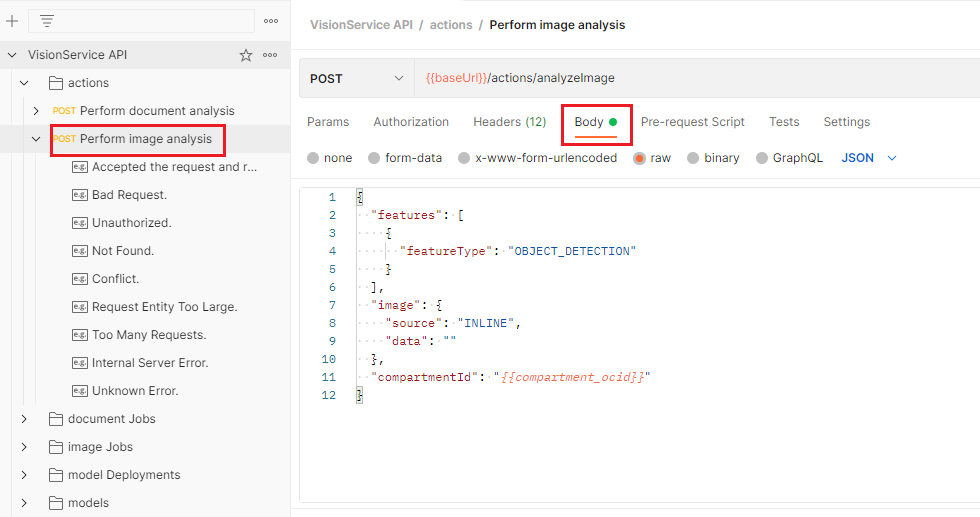

1. Replace the contents of the **Body** with the following:

```http
{
  "features": [
    {
      "featureType": "OBJECT_DETECTION"
    }
  ],
  "image": {
    "source": "OBJECT_STORAGE",
    "namespaceName": "<namespace name>",
    "bucketName": "pidaydemo",
    "objectName": "lab-3/skiing.jpg"
  },
  "compartmentId": "{{compartment_ocid}}"
}
```

In the next steps, you will insert your namespace name.
1. To get the namespace name, open the OCI Console, click the **Profile** icon and select **Tenancy: *name***
  

1. Copy the **Object Storage Namespace** value and paste it into the Body in POSTMAN as the value for *namespageName*

1. *bucketName* should be **"pidaydemo"**, which is what was set in Lab 2

1. *objectName* should be **"lab-3/skiing.jpg"**.

1. In POSTMAN, click the **Send** button. The response should return in a few seconds with the result of the image analysis.

1. Review the response and notice the objects that were detected. We'll use this same capability in the next lab to count objects in multiple images.

## **TASK 3:** Invoke the Document AI REST API

In this task, you'll call the Document AI synchronous REST API using POSTMAN.

1. In POSTMAN, select **Collections**, then expand *Vision Service API* then *actions* then click **perform document analysis**. Then select the **Body** tab under *POST*.
  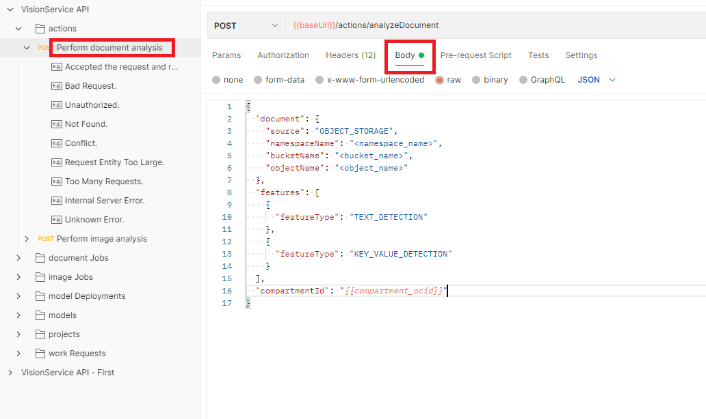

1. Update the contents of the **Body** to the following:
  ```http
  {
    "document": {
      "source": "OBJECT_STORAGE",
      "namespaceName": "<namespace_name>",
      "bucketName": "pidaydemo",
      "objectName": "lab-3/receipt.jpg"
    },
    "features": [
      {
        "featureType": "TEXT_DETECTION"
      },
      {
        "featureType": "KEY_VALUE_DETECTION"
      }
    ],
    "compartmentId": "{{compartment_ocid}}"
  }
  ```

3. Set **namespaceName** to the same value you used in the previous document analysis task

1. *bucketName* should be **"pidaydemo"** or whatever name you used for the object storage bucket in Lab 2.

1. *objectName* should be **"lab-3/receipt.jpg"**

1. Click **Send**. The response should return in a few seconds with the result of the image analysis.

1. Review the response and notice the structure of the data and the text extracted along with confidence and location.

You have completed this lab!

[Proceed to the next lab](./Lab-4-vision-app.md).
