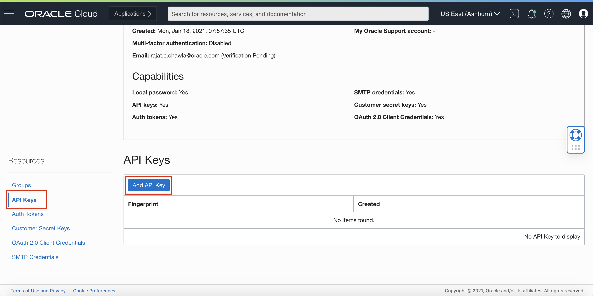
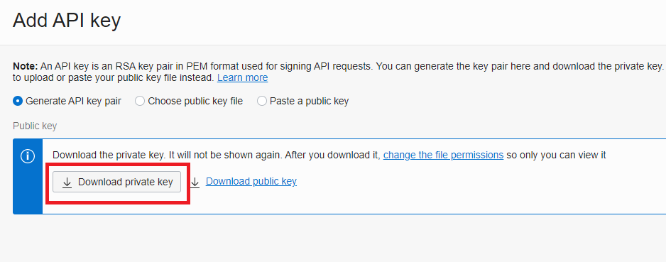
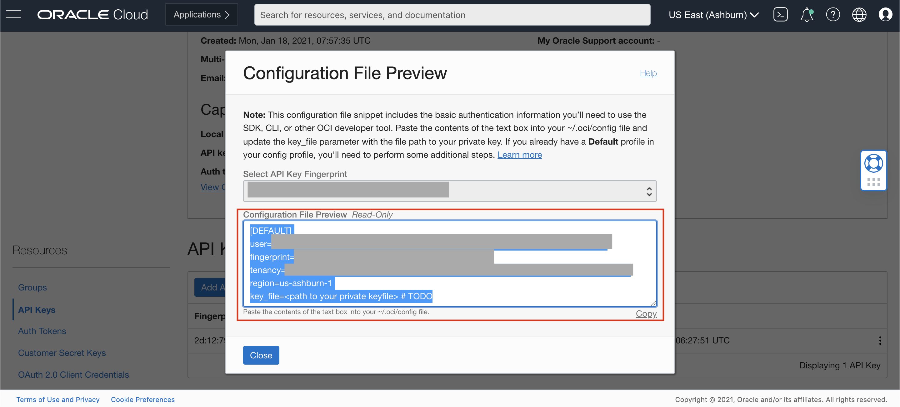
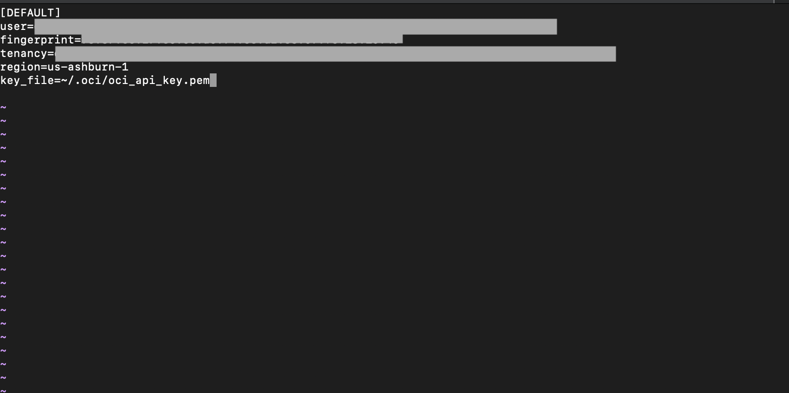

# Lab 4: Access OCI Vision with the Vision Python SDK

## Introduction

In this lab you will use the Python SDK to identify if any workers in an image are not wearing their helmet. The python script will analyze 7 images, count the number of people in the image, count the number of helmets in the image, and compare the results to determine which images include workers who are not wearing their helmet.

[SDK for Python](https://docs.oracle.com/en-us/iaas/Content/API/SDKDocs/pythonsdk.htm#SDK_for_Python)

Example of worker wearing their helmet:


Example of workers not wearing their helmets:


*Estimated Lab Time*: 10 minutes

### Objectives:

* Learn how to use Vision Python SDK to communicate with our Vision service endpoints.

<!-- ### Prerequisites:
* Familiar with Python programming is required
* Familiar with local editing tools, vi and nano -->


## **TASK 1:** Setup API Signing Key and Config File

1. Create the .oci folder. Open an admin command prompt or Terminal and run the following command.

    Windows:
    ```
    mkdir %HOMEDRIVE%%HOMEPATH%\.oci
    ```

    Mac OS / Linux:
    ```
    mkdir ~/.oci
    ```

1. Generate an API signing key pair

    > **Note**: If you completed lab 3, you already created an API Key. If that's the case, navigate to the key and skip to step f. below.

    a. Open My Profile

    Open the **Profile** menu (User menu icon) and click **your user name**.

      

    b. Open API Keys

    Navigate to **API keys** and then Click **Add API Key**.

      

    c. Generate API Key

    In the dialog, select **Generate API key pair**. Click **Download Private Key**.

      

    d. Save Private Key

    Save the private key that downloaded to your **.oci** directory.

    e. Add the API Key

    Click **Add**.

      

    f. Generate Config File

    Use the 3 dots on the row where the key is listed and select **View Configuration file**. Copy the values shown on the *Configuration File Preview*. You will paste them into a file in the next step.

            

3. Create a file with the name *config* (with no extension) in the .oci folder and paste the values previously copied.

     Replace the **key_file value** with the path of your generated private key.

      

      

To Know more visit [Generating API KEY](https://docs.oracle.com/en-us/iaas/Content/API/Concepts/apisigningkey.htm) and [SDK and CLI Configuration File](https://docs.oracle.com/en-us/iaas/Content/API/Concepts/sdkconfig.htm#SDK_and_CLI_Configuration_File)

## **TASK 2:** Install Python

> **Note**: If you already have Python 3.x and pip, and Python is available from your command line, skip to Task 3.

1. Confirm you have Python 3.x

    a. If you're using Windows, open an admin command prompt. If you're on a Mac, open the Terminal.

    b. Run the following from the python installation folder (Example Python installation folder on Windows: C:\Users\<user>\AppData\Local\Programs\Python\<Python version>)

      Windows:
      ```
      python --version
      ```
      
      Mac OS / Linux:
      ```
      python3 --version
      ```

      If you have Python 3.x continue to step 2. If you receive an error or have a Python version less than 3.x, continue to step 1.c.

    c. Install Python

      Install the latest version of Python from [python.org](https://www.python.org).

      After installation, run the following to confirm you have access to Python from the command line.

      Windows:
      ```
      python --version
      ```
      
      Mac OS / Linux:
      ```
      python3 --version
      ```

2. Confirm you have pip

    a. Check for pip by running the following:
    You may need to change directory to the \Scripts folder. e.g. C:\Users\<user>\AppData\Local\Programs\Python\Scripts

      Windows:
      ```
      pip --version
      ```
      
      Mac OS / Linux:
      ```
      pip3 --version
      ```

      If pip is available, continue to task 3. If not, continue to step 2.b.

    b. Download [get-pip.py](https://pip.pypa.io/en/stable/installation/).

    c. Copy to Python installation folder

      Example Python installation folder on Windows: C:\Users\<user>\AppData\Local\Programs\Python\<Python version>

    d. Add pip

      Cd to folder containing get-pip.py

      Run the following:

      ```
      py get-pip.py
      ```

    e. Confirm pip by running the following

      Windows:
      ```
      pip --version
      ```
      
      Mac OS / Linux:
      ```
      pip3 --version
      ```

## **TASK 3:** Setup for Python

1. Create virtualenv

    To create a virtual environment, run the venv module as a script as shown below
    
    Windows:
    ```
    python -m venv <name of virtual environment>
    ```
    
    Mac OS / Linux:
    ```
    python3 -m venv <name of virtual environment>
    ```

2. Activate virtualenv

    Once you’ve created a virtual environment, you may activate it.

    Windows:
    ```
    <name of virtual environment>\Scripts\activate
    ```

    Mac OS / Linux:
    ```
    source <name of virtual environment>/bin/activate
    ```

3. Install OCI

    Now Install oci by running:
    
    Windows:
    ```
    pip install oci
    ```
    
    Mac OS / Linux:
    ```
    pip3 install oci
    ```

## **TASK 4:** Add Sample Images to Object Storage

> **Note:** If you previously completed Lab 2, you uploaded the Lab 4 images into an object storage folder called *lab-4* and you also created another folder called *output*. If so, skip to Task 5.

1. Download the [Lab-4 sample images](./Sample-Images/Lab-4).

2. Login to the OCI Console and navigate to your Object Storage Buckets

  

3. Create a new bucket called "pidaydemo".

4. Create a new folder called "lab-4".

5. Upload the sample images to the "lab-4" folder.

## **TASK 5:** OCI Vision Service SDK Code Sample

1. Create a new file on your local machine called "helmetdetection.py" and add it to C:\Users\<user>\AppData\Local\Programs\Python\<Python version>\Scripts folder or add it to your Desktop if you are using a Mac.

2. Copy the python code from below into "helmetdetection.py".

#### Python Code

```Python
### Import Packages
import time
import oci
import json
import re

from oci.ai_vision import AIServiceVisionClient
from oci.ai_vision.models.create_image_job_details import CreateImageJobDetails
from oci.ai_vision.models.image_object_detection_feature import ImageObjectDetectionFeature
from oci.ai_vision.models.input_location import InputLocation
from oci.ai_vision.models.object_list_inline_input_location import ObjectListInlineInputLocation
from oci.ai_vision.models.object_location import ObjectLocation
from oci.ai_vision.models.object_storage_document_details import ObjectStorageDocumentDetails
from oci.ai_vision.models.output_location import OutputLocation
from oci.object_storage import ObjectStorageClient

### Define Variables
namespace_name = "<namespace name>"
bucket_name = "<bucket name>"
compartment_id = "<compartment id>"
input_prefix = "<folder name for images>"
output_prefix = "<output folder name for results>"

# Auth Config Definition
config = oci.config.from_file('~/.oci/config')

# AI Vision Client Definition
ai_vision_client = oci.ai_vision.AIServiceVisionClient(config)

### Get Images from Object Storage Using Object Storage Client
# List Objects in Bucket
object_storage_client = ObjectStorageClient(config)
object_list = object_storage_client.list_objects(
    namespace_name = namespace_name,
    bucket_name = bucket_name,
    prefix = input_prefix
)

# Create List of All Testing Images
image_list = []
for i in object_list.data.objects:
    if i.name.endswith('.jpg'):
        object_location = ObjectLocation()
        object_location.bucket_name = bucket_name
        object_location.namespace_name = namespace_name
        object_location.object_name= i.name
        image_list.append(object_location)

### Vision AI
# Send the Request to Service with Multiple Features
image_object_detection_feature = ImageObjectDetectionFeature()
features = [image_object_detection_feature]

# Setup Input Location
object_locations1 = image_list
input_location = ObjectListInlineInputLocation()
input_location.object_locations = object_locations1

# Setup Output Location
output_location = OutputLocation()
output_location.namespace_name = namespace_name
output_location.bucket_name = bucket_name
output_location.prefix = output_prefix

# Details Setup
create_image_job_details = CreateImageJobDetails()
create_image_job_details.features = features
create_image_job_details.compartment_id = compartment_id
create_image_job_details.output_location = output_location
create_image_job_details.input_location = input_location

# Send the testing images to Vision service by calling creat_image_job API to get analyze images and it returns json responses
res = ai_vision_client.create_image_job(create_image_job_details=create_image_job_details)

# Final Prefix Variable
final_prefix= output_prefix+"/"+res.data.id+"/"+namespace_name+"_"+bucket_name+"_"+input_prefix+"/"

# Logic to perform the following statistics:
# 1. Count the number of persons and hardhats in each image, and total up the counts
# 2. Report the person and hardhat counts, and the number of images processed
# 3. Also, list the names of images where the person count and hardhat count don’t match

# Wait for images to be processed
print("Wait for images to be analyzed. Timeout after 90 seconds")
job_status = res.data.lifecycle_state
print("Job status: ", res.data.lifecycle_state)
i = 1
while i <= 18:
    res = ai_vision_client.get_image_job(image_job_id=res.data.id)
    if job_status != res.data.lifecycle_state:
        print("Job status: ", res.data.lifecycle_state)
        job_status = res.data.lifecycle_state
    if res.data.lifecycle_state == 'SUCCEEDED' or res.data.lifecycle_state == 'CANCELING' or res.data.lifecycle_state == 'FAILED' or res.data.lifecycle_state == 'CANCELED':
        break
    else:
        time.sleep(5)
        i+= 1

person_count=0
hat_count=0
image_counter=0
no_match_list=[]

# List all JSON responses received by Vision AI
object_storage_client = ObjectStorageClient(config)
object_list = object_storage_client.list_objects(
    namespace_name = namespace_name,
    bucket_name = bucket_name,
    prefix = final_prefix
)

# Count number of persons and number of hats
for i in object_list.data.objects:
    image_counter=image_counter+1
    body=object_storage_client.get_object(namespace_name, bucket_name, object_name=i.name)
    dict_test= json.loads(body.data.content.decode('utf-8'))
    for j in dict_test['imageObjects']:
        if (j['name'] =='Person' or j['name']=='Man' or j['name']=='Woman' or j['name']=='Human'):
            person_count =person_count +1
        if (j['name'] =='Helmet'):
            hat_count=hat_count+1

    if (person_count!=hat_count):
        no_match_list.append(i.name)


print ("Number of persons found in images:", person_count,"\n")
print ("Number of hardhats found in images:", hat_count, "\n")
print ("Number of images processed:", image_counter, "\n")     
print ("Names of images where hat count is not equal to total number of persons:\n")

for i in no_match_list:
    i=re.sub(final_prefix,'',i)
    i=re.sub('.json','',i)
    print(i)
```

3. Update variables

    Open the python script and update all of the below variables.

      ```Python
      namespace_name = "<namespace name>"
      bucket_name = "<bucket name>"
      compartment_id = "<compartment id>"
      input_prefix = "<folder name for images>"
      output_prefix = "<output folder name for results>"
      ```

    Hints:
    * The "namespace_name" can be found by navigating to the OCI console, selecting your Profile, selecting your tenancy, and finding "Object Storage Namespace".
    * The "compartment_id" can be found by using the hamburger menu and navigating to **Identity & Security** then **Compartments**. Click on the name of the *root* compartment (or whichever compartment you have been using for this lab). Copy the **OCID** for the compartment.
    * The "bucket_name" should be set to "pidaydemo".
    * The "input_prefix" should be set to "lab-4".
    * The "output_prefix" should be set to "output"


4. Execute the code

    Navigate to the directory where you saved the above file using your terminal or the command line and execute the file by running the following command (from the /Scripts folder):
    
    Windows:
    ```
    python helmetdetection.py
    ```
    
    Mac OS / Linux:
    ```
    python3 helmetdetection.py
    ```

5. Result

    You will see the following results:

    ```
    Wait for images to be analyzed. Timeout after 90 seconds
    Job status:  ACCEPTED
    Job status:  IN_PROGRESS
    Job status:  SUCCEEDED
    Number of persons found in images: 14

    Number of helmets found in images: 6

    Number of images processed: 7

    Names of images where helmet count is not equal to total number of persons:

    constructionsite5.jpg
    constructionsite6.jpg
    constructionsite7.jpg
    ```

    Confirm the results by looking at each image.

    Take a look at the JSON output in your Oracle Object Storage bucket.

## Learn More
To know more about the Python SDK visit [Python OCI-Vision](https://docs.oracle.com/en-us/iaas/tools/python/2.58.0/api/ai_vision/client/oci.ai_vision.AIServiceVisionClient.html)

Congratulations on completing this lab!

[Proceed to the next lab](./Lab-5-custom-model.md).
