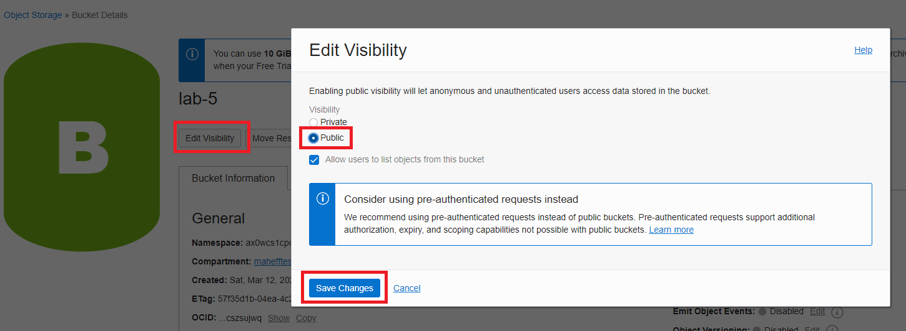
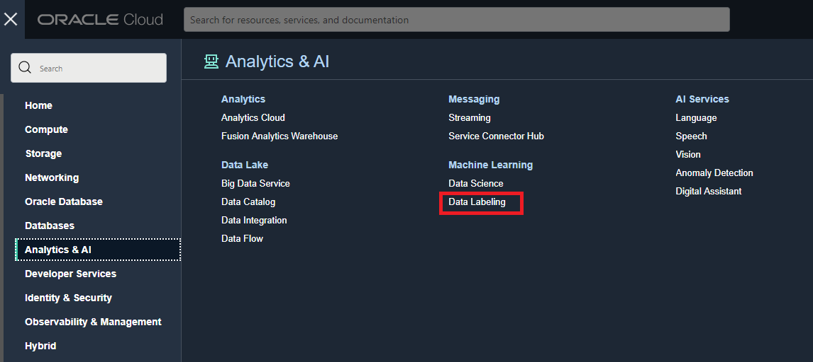
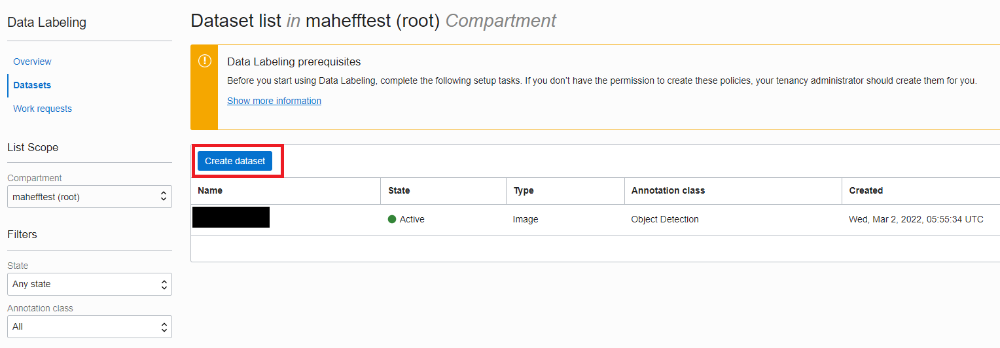
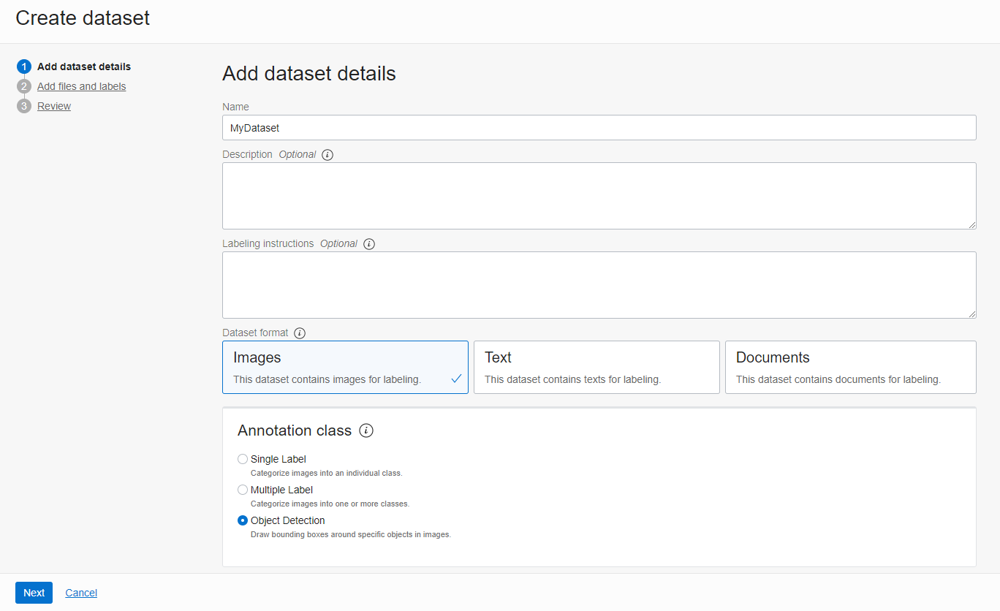
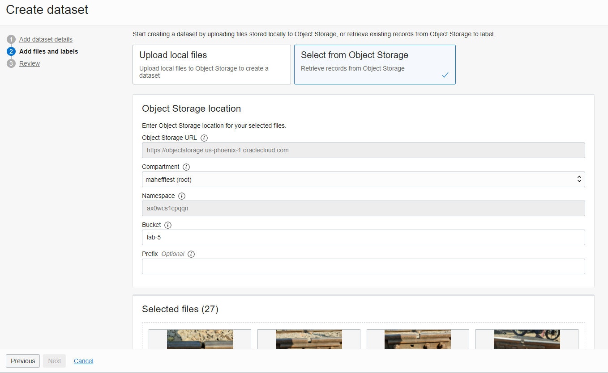
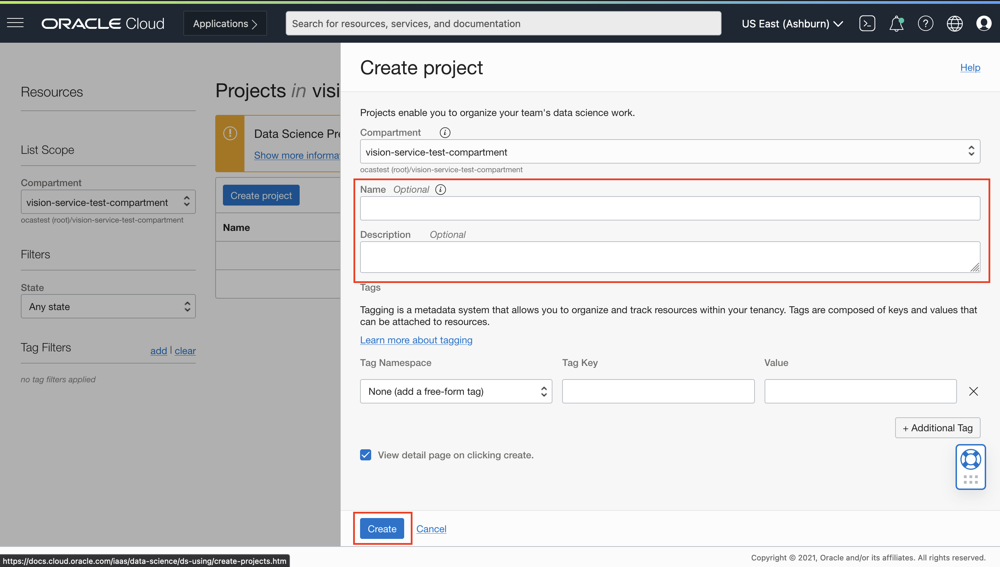
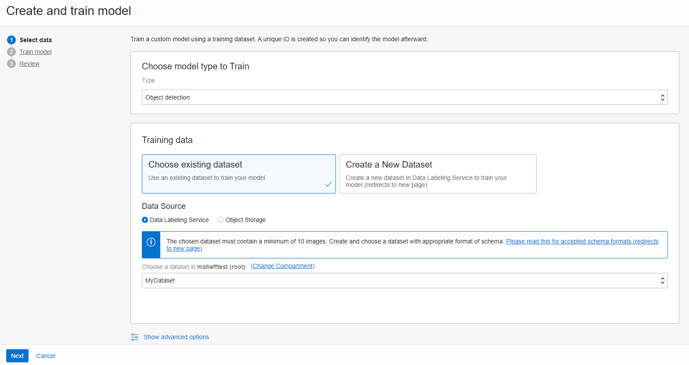
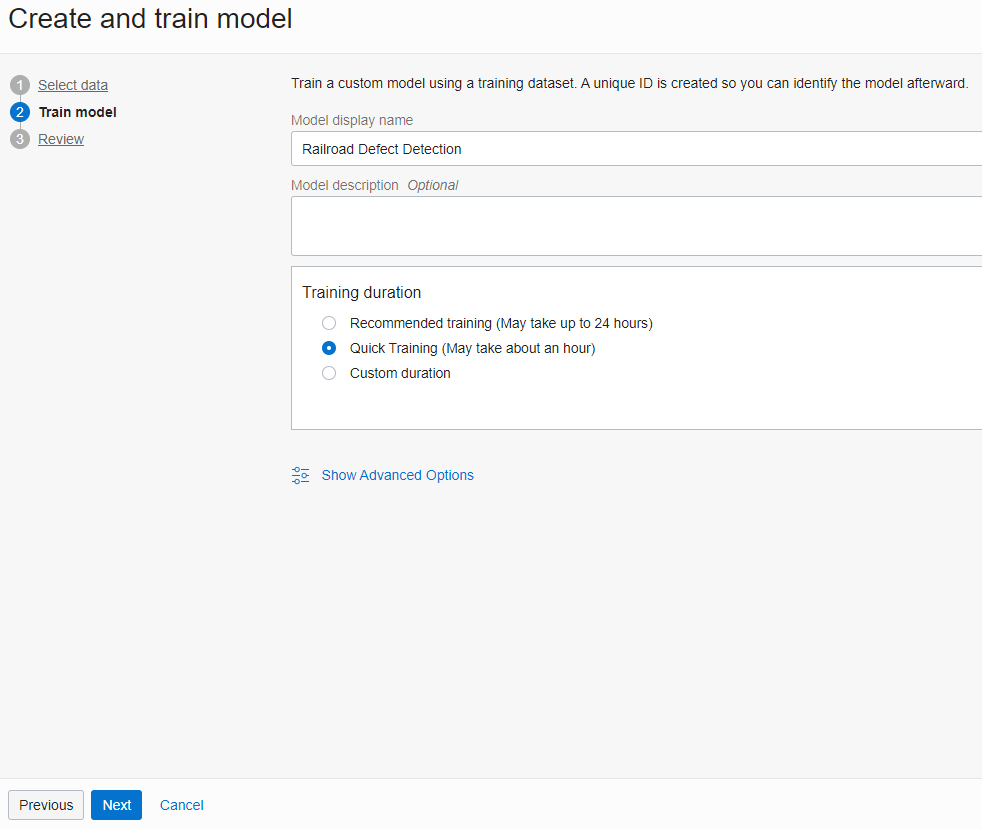
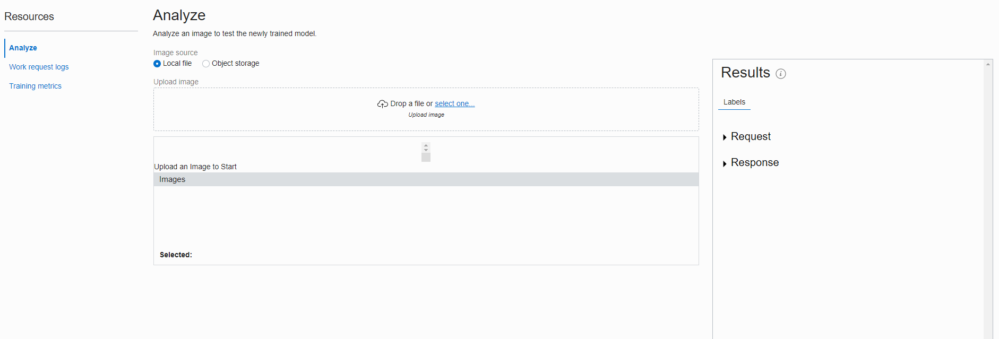

# Lab 5: Create a Custom Model through the OCI Console

## Introduction
In this session, we will show you how to create a vision project, select your training data, label the data, and train a custom model all without the need for any machine learning experience. The custom model will identify missing bolts on a railroad. 

*Estimated Time*: 1 hour+ depending on how long you train your model

### Objectives

In this lab, you will:
- Learn how to create vision project.
- Understand the schema for training data.
- Learn how to train an image classification or object detection model through the OCI console.

### Prerequisites
- Familiar with OCI Object Storage to upload data.

## **Policy Setup**

Before you can start using OCI Vision you need to have permission to access the Vision service. If you don't have permission to access the service, follow the Stack Setup instructions in [Lab 2](./Lab-2-analyze-vision.md).

For simplicity, this lab makes the Object Stoage bucket visible to the public so no additional policies need to be added. In a production scenario, you instead would want to add a policy to access training datasets in Object Storage. More information can be found in the [Vision policy documentation](https://docs.oracle.com/en-us/iaas/vision/vision/using/about_vision_policies.htm#about_vision_policies). 

## **Task 1:** Add Images to Object Storage

1. Download the Lab-5 training and test images from [Lab-5](./Sample-Images/lab-5). The images are divided into TrainingSet1, TrainingSet2, and TestImages.

1. Unzip each folder and combine the TrainingSet1 images and the TrainingSet2 images on your local machine. Those two folders are only seperated in Github since there is a 25mb file size limit. Make sure and keep the test images seperate.

1. Open the OCI Console, select the burger menu, select **Storage**, and select **Buckets**.

1. Select **Create Bucket**, name the bucket "lab-5", and select **Create**. "Standard" default storage tier and "Encrypt using Oracle manage keys" should be selected. 

1. Select the "lab-5" bucket, select **Upload**, and add all the training images, then select **Upload**. There are 27 training images.

    > **Note:** Do not add the test images.

    
    
1. Wait for the images to upload, then select **Close**.

1. Finally, select **Edit Visibility**, select **Public**, and select **Save Changes**. For simplicity, this lab makes the Object Stoage bucket visible to the public so no additional policies need to be added. In a production scenario, you instead would want to add a policy to access training datasets in Object Storage. More information can be found in the [Vision policy documentation](https://docs.oracle.com/en-us/iaas/vision/vision/using/about_vision_policies.htm#about_vision_policies).

    

## **Task 2:** Create Dataset

1. Open the OCI Console, select the burger menu, select **Analytics & AI**, select **Data Labeling**.

    

1. Select **Datasets** and select **Create Dataset**.

    
    
1. Name the dataset "MyDataset", select **Images** as the dataset format, select **Object Detection** for the Annotation class, then select **Next**.

    

1. Select **Select from Object Storage**, then select the "lab-5" bucket. You should see the images appear below.

    

1. Next, add the label "missing bolt", then select **Next**.

    
    
1. Review the details and select **Create**.

1. After selecting Create, you'll see the records being generated. It will take a couple minutes for all the records to be generated. There is a progress in the top right.

    
    
## **Task 3:** Label the Data

1. Once the data records have been generated, select an image.

1. Label the missing bolts by drawing a bounding box around each missing bolt. Make sure the make the bounding boxes as accurate as possible. Then select **Save & next**. Do this until all the images have been labeled.

    

## **Task 4:** Create a Project

A Project is a way to organize multiple models in the same workspace.

1. Log into OCI Console. Using the burger menu on the top left corner, navigate to **Analytics and AI** in the menu and select it, and then select **Vision** under AI Services. Clicking the Vision service will navigate you to the Vision service Console page. Once here, select **Projects** under the "Custom Models" header on the left side of the OCI Console.

    

1. Select **Create Project** and name the project "Lab 5".

    

1. Once the details are entered, select **Create**. If the project is successfully created it will show up in projects pane and the Status will be "ACTIVE".

## **Task 5:** Create the Model

1. Select the "Lab 5" project.

1. Select **Create Model**.

1. Select **Object detection** as the model type, select **Choose existing dataset**, select **Data Labeling Service** as the Data Source, select the **MyDataset**, then select **Next**.

    
    
1. Name the model "Railroad Defect Detection", select **Quick Training**, then select **Next**. In a production scenario you will want to use "Recommended training" but since you are testing the service, "Quick Training" is sufficient. 

    
    
1. Review the model configuration and select **Create and train**. The model may take up to about an hour to train. 

## **Task 6:** Test the Custom Model

1. Open the "Railroad Defect Detection" model in the OCI Console and select **Analyze**.

    
    
1. Select **select one...** and naviage to where you saved the TestImages from Task 1 on your local machine. Try analyzing each of the test images. One image has all bolts so it should return no results since no bolts are missing. The other image is missing a bolt so the custom model should identify the missing bolt.

    

### Congratulations on completing this lab and workshop!
