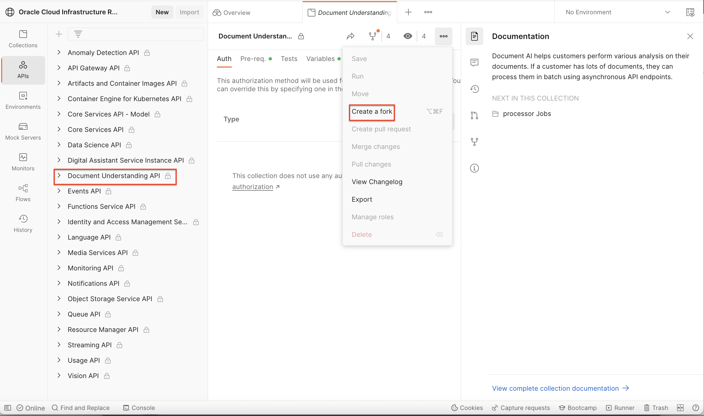
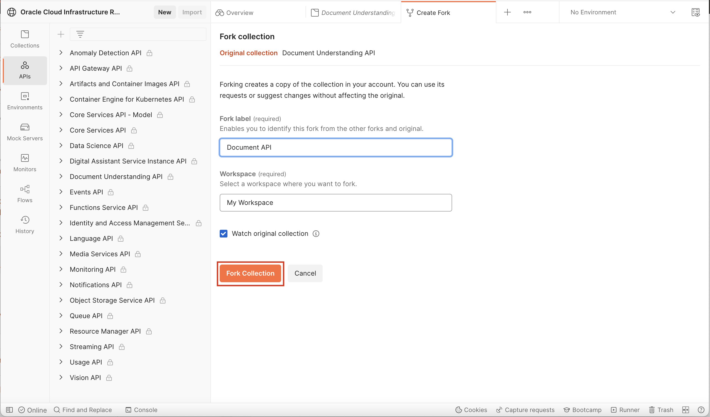
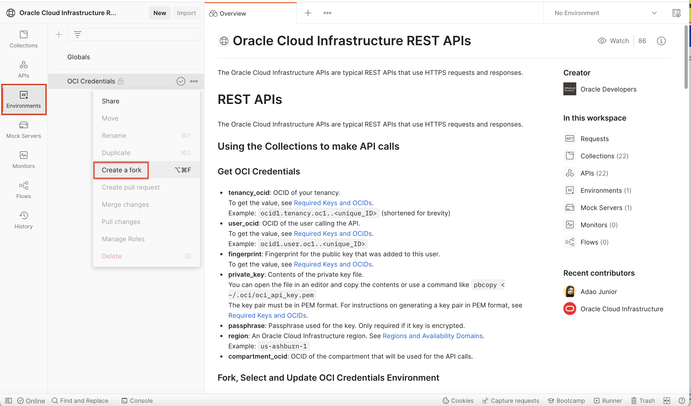
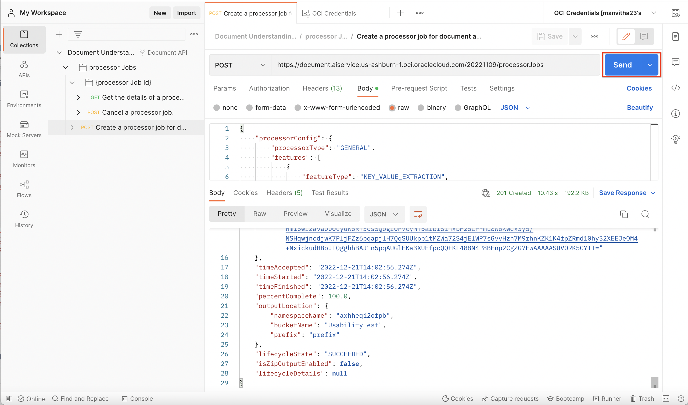

# Lab 5: Call your model through REST API using Postman
## Introduction

In this lab, we will use Document Understanding Services in Postman.

Estimated Time: 15 minutes


### Objectives

In this workshop, you will:

* Learn how to call the model using REST API calls through postman

### Prerequisites:

* Basic knowledge of REST API calls.
* Postman GUI in your local setup. If you don't have POSTMAN, please download it from [POSTMAN](https://www.postman.com/downloads/)

## TASK 1: Setting Up Postman for OCI Document Service REST APIs

* Visit the [OCI Postman workspace](https://www.postman.com/oracledevs/workspace/oracle-cloud-infrastructure-rest-apis/api/79bbefd7-4bba-4370-b741-3724bf3c9325) and login with your credentials.
* Fork the Document Understanding API collection in your workspace by navigating to Document Understanding API collection and clicking the **"Fork"** option.



* Enter a name to identify the forked Document Understanding API collection, select the workspace you want to fork the collection to, and click **"Fork Collection"**.



* Fork the OCI Credentials Environment in your workspace by navigating to Environments and clicking the **"Fork"** option.



* Enter a name to identify the forked OCI credentials environment, select the workspace you want to fork the collection to and click **"Fork Collection"**.


* Navigate to your workspace and open the newly forked environment (OCI Credentials), and set the variables tenancyId, authUserId, keyFingerprint, and private Key. These are the same va;ue that are found in the .oci file you created in Lab 4 (Task 2). 
* Make sure to set both Initial Value and Current Value of the variables(set both as the same value).
* Click the Save button to commit your changes to the environment.


## TASK 2: Invoke Document Understanding OCI REST APIs

* Navigate to **"Create a processor job for document analysis"** section under _"processor Jobs"_


* Update the base url with "https://document.aiservice.{region}.oci.oraclecloud.com/20221109" and region being the one in which model is created.

  (sample url: https://document.aiservice.us-ashburn-1.oci.oraclecloud.com/20221109/processorJobs)


* Navigate to **"raw"** under _"body"_ section to enter the payload for request. Change the format to _"JSON"_


* Edit the payload given below according to your model ID, data(in inputLocation), outputLocation, and compartment ID

  (Note: data should be base64 encoded)
  ```
  {
    "processorConfig": {
      "processorType": "GENERAL",
        "features": [
          {
            "featureType": "KEY_VALUE_EXTRACTION",
            "modelId": <model_id>
          }
        ]
      },
    "inputLocation": {
      "sourceType": "INLINE_DOCUMENT_CONTENT",
      "data": <base64 encoded document>
    },
    "outputLocation": {
      "bucketName": <name of the bucket>,
      "namespaceName": <namespace under which model exists>,
      "prefix": "prefix"
    },
    "compartmentId": <ID of the compartment where the model is created>
  }
  ```

* Enter the payload in the postman and click on "send". 
* We will get the response with the request details and Processor job details. In the response **"lifecycleState"** should be in <code>SUCCEEDED</code> state.



* The output JSON file can be found in the "outputLocation" specified by the user. 
* Navigate to the bucket mentioned in the ouputLocation and click on Objects under Resources section. 
* You will find the output file similar to the one shown below in the following path: "prefix/{Processorjob_ID}/_/results/defaultObject.json". 
  (Note: Processorjob_ID can be found denoted as "id" in the response obtained in the previous step)


* Sample Output JSON file: [defaultObject.json](./defaultObject.json)

## **Summary**

Congratulations! </br>
In this lab, you have learnt how to invoke the model through postman.

Hurray!! You have successfully completed this workshop. In this workshop you had learnt:
* To create and label a dataset
* To create and train a model in OCI console
* Call model through different platforms like OCI console, Datascience Notebook(through preview SDK), and Postman

## Stay in Touch!

* Read our blog posts at [https://blogs.oracle.com/ai-and-datascience/](https://blogs.oracle.com/ai-and-datascience/)

* [Watch our tutorials on YouTube](https://www.youtube.com/playlist?list=PLKCk3OyNwIzv6CWMhvqSB_8MLJIZdO80L).

* Our service documentation is also available at [https://docs.oracle.com/en-us/iaas/data-science/using/data-science.htm](https://docs.oracle.com/en-us/iaas/data-science/using/data-science.htm)
